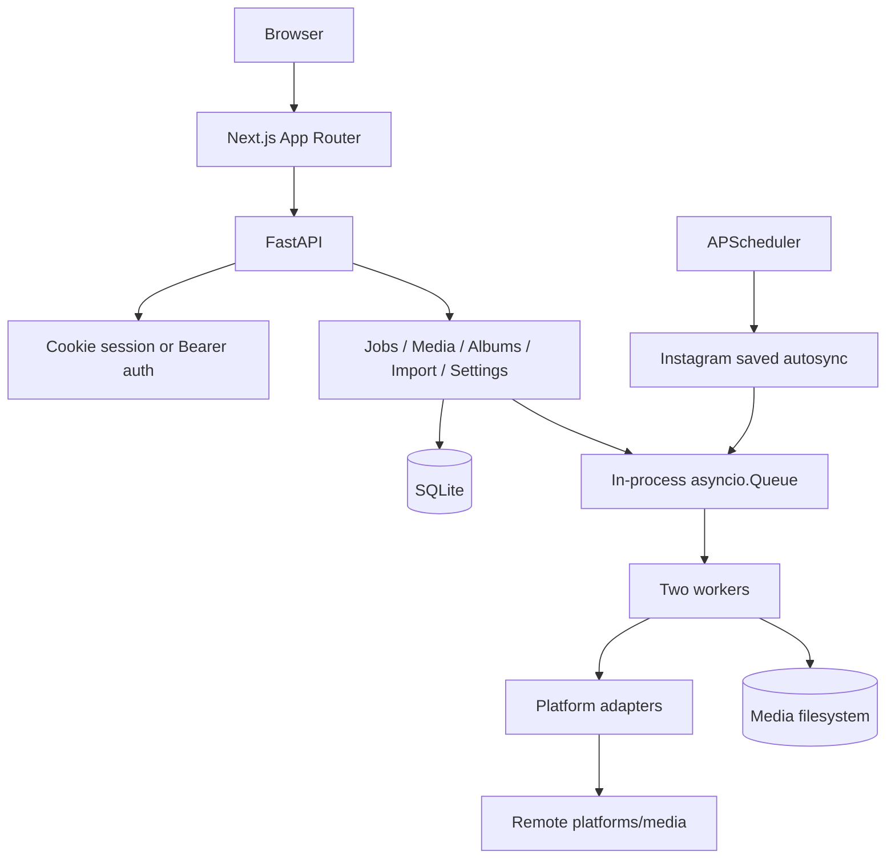

# Optimization Report

## 1. Executive Summary

MediaVault is a self-hosted social-media downloader and archive implemented as a Python/FastAPI modular monolith with SQLAlchemy/SQLite, an in-process worker queue, APScheduler autosync, and a Next.js/React frontend. Current strengths include cookie plus Bearer authentication, restart queue recovery, bounded parsers and uploads, disk-backed ZIP generation, strict TypeScript, working lint/typecheck/build gates, and a patched frontend dependency tree.

This incremental audit supersedes stale report claims. Queue recovery exists (`backend/app/service.py:39-50`); Next.js is `16.3.3` (`frontend/package.json:17`); parser caps and disk-backed ZIP exist (`backend/app/config.py:24-30`, `backend/app/routes/media.py:517-579`); studio polling is reduced to 100 jobs every five seconds (`frontend/src/app/page.tsx:57-59,155`); lint exists (`frontend/package.json:8-13`); authentication accepts a secure cookie session or Bearer token (`backend/app/main.py:80-89`); Vidara public non-DRM adapter is registered (`backend/app/adapters/vidara.py:18-100`, `backend/app/adapters/registry.py:46,77-79`).

Critical risk: a live-format Instagram session file is tracked under `config/uploads/`, while `.gitignore` only covers `config/*.session`, not nested uploads (`.gitignore:15-17`). Contents were not read or printed. High risks remain: production launcher copies `API_TOKEN` into browser-public `NEXT_PUBLIC_API_TOKEN` (`run-production.ps1:85-86`); Threads downloads URLs derived from remote HTML without public-host validation and reads entire responses (`backend/app/adapters/threads.py:256-267,325-357`); TikTok/Threads remote media downloads have no byte cap (`backend/app/adapters/tiktok.py:104-109`, `backend/app/adapters/threads.py:336-357`); portfolio routes retain N+1 queries; dominant filters lack indexes; vault polling remains client-heavy; Python dependencies lack a lock; frontend has no tests.

Recommendation: no rewrite. Immediately remove the tracked session from the index, rotate/revoke it, repair nested ignore rules, and inspect history without exposing credentials. Then remove browser token embedding, validate every derived remote URL at connection time, cap streamed downloads, eliminate N+1 queries, add measured indexes, reduce polling, and protect critical backend/frontend workflows with tests.

## Vidara Implementation Status

Implemented `backend/app/adapters/vidara.py`: strict Vidara URL detection, public HTTPS validation for page/embed/API/stream/redirect URLs, cookie-free GET/POST resolution, DRM rejection, missing-stream errors, streamed MP4 byte cap, and existing-`yt-dlp`-only HLS fallback. Registered in `backend/app/main.py` and `backend/app/adapters/registry.py`, allowlisted in `backend/app/url_validation.py`, exposed in frontend platform chips, filters, icons, badges, and health/job views. Mocked coverage added in `backend/tests/test_vidara.py`. Vidara bulk TXT import is separated at `POST /api/import/vidara`, with one strict URL per line, UTF-8 validation, blank/comment handling, deduplication, limits, job IDs, and shared frontend bulk progress (`backend/tests/test_vidara_import.py`; `frontend/src/components/modals/ArchiveImportModal.tsx`). Latest validation: 35 tests passed + 5 subtests; compileall, pip check, lint, typecheck, build, and diff-check passed.

## 2. Audit Metadata

| Item | Value |
|---|---|
| Audit Date | 2026-08-29 |
| Repository | MediaVault (`mediavault`) |
| Branch | `master` |
| Commit | `040b49a85d946e03fa2b2985b9493ce87ad2fa6b` |
| Auditor | Codebase Architect & Optimization Auditor |
| Audit Mode | Read-only incremental audit; only this report updated |
| Status | Completed |

Verified command evidence supplied for this audit: `pytest` **28 passed + 5 subtests, 9 warnings**; `pip check` **pass**; `npm audit` **0 vulnerabilities**; frontend lint, typecheck, and build **pass**. Repository identity was independently confirmed as branch `master`, commit `040b49a85d946e03fa2b2985b9493ce87ad2fa6b`. No secret/session contents were inspected.

## 3. Technology Stack

| Category | Technology | Version | Evidence | Confidence |
|---|---|---:|---|---|
| Backend runtime | Python | `>=3.11,<3.15` | `pyproject.toml:5` | High |
| Backend framework | FastAPI, Uvicorn | `>=0.115`, `>=0.30` | `pyproject.toml:7-8`; `backend/app/main.py:71-120` | High |
| ORM/database | SQLAlchemy, SQLite default | `>=2.0` | `pyproject.toml:9`; `backend/app/config.py:17`; `backend/app/db.py:46-174` | High |
| Scheduler/queue | APScheduler, `asyncio.Queue` | `>=3.10`, stdlib | `pyproject.toml:12`; `backend/app/service.py:25,76-80`; `backend/app/main.py:60-64` | High |
| Security/config | cryptography, Pydantic Settings | `>=43`, `>=2.4` | `pyproject.toml:10,13`; `backend/app/vault.py:8-21`; `backend/app/config.py:10-39` | High |
| Download engines | yt-dlp, gallery-dl, Instaloader | `>=2024.12`, `>=1.27`, `4.13` | `pyproject.toml:17-22` | High |
| Frontend | Next.js App Router | `16.3.3` | `frontend/package.json:17`; `frontend/src/app/` | High |
| UI runtime | React / React DOM | `19.2.1` | `frontend/package.json:18-19` | High |
| Styling/motion | Tailwind CSS, Framer Motion | `^4.3.3`, `^13.1.1` | `frontend/package.json:16,27` | High |
| Language/tooling | TypeScript, ESLint | `5.7.2`, `^9.0.0` | `frontend/package.json:25,28`; scripts `:12-13` | High |
| Testing | pytest | `>=8.0` | `pyproject.toml:23-29`; `backend/tests/`; `tests/` | High |
| CI/CD | GitHub Actions, PowerShell/Bash launchers | Repository-defined | `.github/workflows/ci.yml`; `run-local.ps1`; `run-production.ps1` | High |
| Package management | PEP 621/pip, npm lockfile | Unlocked Python; locked npm | `pyproject.toml`; `frontend/package-lock.json` | High |

## 4. Architecture Overview

MediaVault is a two-process modular monolith. Browser requests reach Next.js App Router pages; `/api` traffic reaches FastAPI. FastAPI middleware authenticates protected API calls using either cookie session state or Bearer token (`backend/app/main.py:80-89`). Routers cover health, authentication, observability, imports, jobs, media, albums, adapters, autosync, and settings (`backend/app/main.py:99-108`).

Job submission persists a `Job`, then queues its ID in an in-process `asyncio.Queue` (`backend/app/service.py:97-120`). Startup recovery resets running jobs and requeues persisted queued jobs (`backend/app/service.py:39-50`). Two workers process adapters (`backend/app/main.py:62-64`). SQLite stores jobs, media metadata, settings, albums, and autosync state; filesystem stores downloaded assets. APScheduler runs Instagram saved-post autosync. This is suitable for local single-node use, not horizontal scaling without an external broker and shared storage.

## 5. Feature Inventory

| ID | Feature | Location | Status | Test Coverage | Risk |
|---|---|---|---|---|---|
| FEAT-001 | Single/bulk URL download | `backend/app/routes/jobs.py`; `backend/app/service.py:97-199`; `frontend/src/components/studio/DownloadStudio.tsx` | Complete | Partial backend | High |
| FEAT-002 | Multi-platform adapters | `backend/app/adapters/`; `backend/app/main.py` | Complete, platform-dependent | Partial engine tests | High |
| FEAT-003 | Persisted jobs and restart recovery | `backend/app/service.py:39-73`; `backend/app/worker.py` | Complete for one process | Recovery tests present | High |
| FEAT-004 | Cookie and Bearer authentication | `backend/app/main.py:71-89`; `backend/app/routes/auth.py`; `frontend/src/lib/api.ts:1-7` | Complete for single-user vault | Backend auth tests | High |
| FEAT-005 | Media vault/list/filter/file serving | `backend/app/routes/media.py:60-168`; `frontend/src/app/vault/page.tsx` | Complete, inefficient list hydration | No frontend tests | High |
| FEAT-006 | Favorites and batch actions | `backend/app/routes/media.py:171-185`; `frontend/src/app/vault/page.tsx:338-418` | Partial: batch favorite toggles | None | Medium |
| FEAT-007 | Albums CRUD/membership | `backend/app/routes/albums.py`; `frontend/src/components/modals/AlbumModal.tsx` | Partial: edit UI unreachable | None | Medium |
| FEAT-008 | CSV/JSON/ZIP exports | `backend/app/routes/media.py:366-590` | Complete; bounded, disk-spooled ZIP | Bounds tests partial | Medium |
| FEAT-009 | Archive and Vidara TXT bulk import | `backend/app/routes/importer.py`; `backend/app/importer.py`; `backend/app/config.py:24,29-30` | Complete; separate strict Vidara endpoint, capped | Bounds + Vidara parser/route tests | Medium |
| FEAT-010 | Instagram saved-post autosync | `backend/app/autosync.py`; `backend/app/scheduler.py` | Complete, Instagram-only | Partial | High |
| FEAT-011 | Instagram session/settings workflow | `backend/app/routes/settings.py`; `frontend/src/app/settings/page.tsx` | Complete but secret hygiene regressed | Partial | Critical |
| FEAT-012 | Observability/readiness | `backend/app/observability.py`; `backend/app/routes/health.py` | Partial | Limited | Medium |
| FEAT-013 | Production launcher | `run-production.ps1` | Partial: browser token exposure | None | High |
| FEAT-014 | Account/vault encryption model | `backend/app/db.py:46-53`; `backend/app/vault.py` | Incomplete/unintegrated | None | Medium |
| FEAT-015 | Vidara public video download | `backend/app/adapters/vidara.py`; frontend platform components | Complete for public non-DRM streams; HLS depends on yt-dlp | Mocked adapter tests | Medium |

## 6. Feature Gap Analysis

| ID | Gap | Evidence | Confidence | Business Impact | Priority |
|---|---|---|---|---|---|
| GAP-001 | Batch ZIP frontend calls `/api/media/batch/download-zip`, backend exposes `/api/media/batch-zip` | `frontend/src/app/vault/page.tsx:384`; `backend/app/routes/media.py:583-590` | Confirmed | Selected ZIP action fails with 404 | P1 |
| GAP-002 | Album edit state/modal mode exists but no reachable edit trigger sets `editingAlbum` | `frontend/src/app/vault/page.tsx:110-112,446-453,1122-1124`; `frontend/src/components/modals/AlbumModal.tsx` | Confirmed | Existing albums cannot be edited from UI | P2 |
| GAP-003 | Batch favorite issues one toggle per item instead of setting target state | `frontend/src/app/vault/page.tsx:413`; backend supports explicit state at `backend/app/routes/media.py:176-182` | Confirmed | Mixed selections produce surprising state; request burst | P1 |
| GAP-004 | Autosync remains Instagram-only | `backend/app/scheduler.py`; `backend/app/autosync.py`; platform settings in `backend/app/db.py:156-172` | Confirmed | Other supported adapters cannot autosync | P2; business confirmation |
| GAP-005 | Dead UI components remain unintegrated | `frontend/src/components/vault/GooglePhotosSidebar.tsx`; `frontend/src/components/vault/VaultSidebar.tsx` only supplies shared type to `frontend/src/app/vault/page.tsx:15` | Confirmed | Maintenance and bundle/source complexity | P2 |
| GAP-006 | `Account.encrypted_session` and Fernet vault helpers are not integrated with runtime session settings | `backend/app/db.py:46-53,145-151`; `backend/app/vault.py`; settings routes use session files | Likely | Conflicting session-security models | P2; business confirmation |
| GAP-007 | Frontend has no automated tests or test script | No `*.test.*`/`*.spec.*`; `frontend/package.json:8-14` | Confirmed | UI/auth/polling regressions undetected | P1 |

## 7. Architecture Findings

| ID | Finding | Evidence | Impact | Recommendation | Priority |
|---|---|---|---|---|---|
| ARCH-001 | Queue recovery exists; stale claim that startup drops jobs is resolved | `backend/app/service.py:39-50`; atomic claim `:53-73` | Restart reliability improved | Keep deterministic recovery/lease tests; external broker only if multi-process scaling is required | Resolved/monitor |
| ARCH-002 | DB and filesystem still lack one transaction boundary | Download service and media deletion span DB/filesystem in separate operations | Orphans or missing files after partial failure | Add reconciliation/tombstone workflow and failure-injection tests | P2 |
| ARCH-003 | Frontend vault page remains oversized and owns polling, transformations, mutations, albums, exports, and UI | `frontend/src/app/vault/page.tsx:110-243,338-453,1122-1124` | High regression surface | Extract API/state hooks only where tests justify seams | P2 |
| ARCH-004 | Authentication architecture improved to cookie plus Bearer, but production launcher defeats server-only token boundary | `backend/app/main.py:80-89`; `frontend/src/lib/api.ts:1-7`; `run-production.ps1:85-86` | Static browser bundle can disclose API token | Use cookie auth for browser; keep API token server-only for automation | P1 |
| ARCH-005 | In-process queue and SQLite constrain horizontal scaling | `backend/app/service.py:25,76-80`; `backend/app/config.py:17` | Multiple app processes cannot safely share in-memory dispatch | Retain single-process contract or adopt broker/shared DB after measured need | P3 |
| ARCH-006 | Account encryption schema and file-session runtime are competing abstractions | `backend/app/db.py:46-53,145-151`; `backend/app/vault.py` | Security behavior unclear | Choose one model; migrate/remove unused model | P2 |

## 8. Code Quality Findings

| ID | Finding | Location | Evidence | Impact | Recommendation | Priority |
|---|---|---|---|---|---|---|
| CQ-001 | Broad exception swallowing hides remote/file failures | Threads adapter | `backend/app/adapters/threads.py:295-305,335-360` | Silent partial downloads, weak diagnostics | Catch expected exceptions; log redacted URL host/context | P2 |
| CQ-002 | Batch endpoint contract drift | Frontend/backend media | `frontend/src/app/vault/page.tsx:384`; `backend/app/routes/media.py:583` | User-visible broken feature | Align frontend to `/media/batch-zip`; add contract test | P1 |
| CQ-003 | Batch favorite semantics mismatch label/intent | Vault page | `frontend/src/app/vault/page.tsx:413`; explicit backend payload supported at `backend/app/routes/media.py:176-182` | Incorrect final state | Send explicit `is_favorite` or add one batch endpoint | P1 |
| CQ-004 | Dead UI and type ownership coupling | Vault components | `frontend/src/components/vault/GooglePhotosSidebar.tsx`; `VaultSidebar.tsx`; import at `frontend/src/app/vault/page.tsx:15` | Unnecessary maintenance | Move type to shared model; remove truly unused components after product confirmation | P2 |
| CQ-005 | Comments/docstrings are abundant but exception contracts remain ad hoc | `backend/app/service.py:83-94,123-129`; routes/adapters | Operational failures difficult to classify | Introduce stable internal error categories only at high-risk boundaries | P3 |
| CQ-006 | Lint now exists and passes; stale “no lint” finding resolved | `frontend/package.json:13`; verified lint pass | Better static quality gate | Keep in CI | Resolved |

## 9. Performance Findings

| ID | Area | Finding | Evidence | Impact | Recommendation | Priority |
|---|---|---|---|---|---|---|
| PERF-001 | Media portfolio | N+1 file query per media item | `backend/app/routes/media.py:79-83` | Up to 1 + N queries per vault page | Bulk-load files with one `IN` query or ORM `selectinload` | P1 |
| PERF-002 | Creator portfolio | N+1 file query per item | `backend/app/routes/media.py:315-318` | Query count scales linearly | Aggregate counts/thumbnails in SQL or bulk hydrate | P1 |
| PERF-003 | Export portfolio | CSV count and JSON/ZIP file queries run per item | `backend/app/routes/media.py:397-400,445-448,503-506` | Slow large exports, DB contention | Group counts and bulk-load files before serialization | P1 |
| PERF-004 | Database indexes | Only URL/hash/status indexes exist; common media filters/order and FK lookups lack indexes | Existing indexes `backend/app/db.py:87-95`; filters/order `backend/app/routes/media.py:71-77`; FK query `:82`; album join keys `backend/app/db.py:119-129` | Table scans/sorts as vault grows | Add measured composite/indexes for `created_at`, `platform`, `username`, `is_favorite`, `media_files.media_item_id`, album join FKs | P1 |
| PERF-005 | Vault polling | Fetches up to 1,500 media plus other resources every 10 seconds | `frontend/src/app/vault/page.tsx:140,180,240-243` | Repeated DB/network/render load | Paginate; poll only active jobs/session state; invalidate after mutations | P1 |
| PERF-006 | Studio polling | Improved from stale report: 8 media + 100 jobs every 5 seconds | `frontend/src/app/page.tsx:57-59,155` | Better but still permanent polling | Stop when no active jobs or use event stream later | P2 |
| PERF-007 | Download memory/disk | Threads reads whole media responses; TikTok copies unbounded streams | `backend/app/adapters/threads.py:336-357`; `backend/app/adapters/tiktok.py:104-109` | Memory/disk exhaustion | Stream fixed chunks with per-file and aggregate byte caps | P1 |
| PERF-008 | ZIP/parser | Stale in-memory ZIP/unbounded-parser findings resolved | Caps `backend/app/config.py:24-30`; spooled ZIP `backend/app/routes/media.py:501-579` | Resource exposure materially reduced | Keep caps and regression tests | Resolved |

## 10. Security Findings

| ID | Severity | Category | Finding | Evidence | Recommendation | Priority |
|---|---|---|---|---|---|---|
| SEC-001 | Critical | Secret/session management, CWE-312 | Instagram session file is tracked under nested `config/uploads/`; current ignore patterns only match direct children | Git index identifies `config/uploads/instagram-session-*.session`; `.gitignore:15-17` | Remove from index, rotate/revoke session, add recursive/session-upload ignore, inspect and purge history if needed; never print contents | P0 |
| SEC-002 | High | Credential exposure, CWE-200 | Production script copies API bearer token into `NEXT_PUBLIC_API_TOKEN`, making it browser-bundle accessible | `run-production.ps1:85-86` | Remove browser token injection; browser uses HttpOnly cookie; automation token remains server-only | P1 |
| SEC-003 | High | SSRF, CWE-918 | Threads validates initial post URL indirectly but downloads image/video URLs parsed from remote HTML with unrestricted opener | Derived URLs `backend/app/adapters/threads.py:256-267`; requests `:325-357` | Validate scheme, host, DNS, redirects, and peer IP for every derived URL using guarded opener | P1 |
| SEC-004 | High | Resource exhaustion, CWE-400/770 | Remote media responses have no per-file/aggregate byte cap | `backend/app/adapters/threads.py:336-357`; `backend/app/adapters/tiktok.py:104-109`; config has export/upload caps only `backend/app/config.py:24-30` | Add configurable download byte caps, chunked streaming, cleanup on overflow | P1 |
| SEC-005 | Medium | Authentication boundary | Cookie + Bearer auth now exists; stale “no auth” claim resolved | `backend/app/main.py:73-89`; cookie route `backend/app/routes/auth.py:17` | Prefer cookie for browser; test CSRF/Origin/logout/session timeout | Partially resolved/P1 tests |
| SEC-006 | Medium | SSRF residual | Guarded public opener exists for TikTok, but native engines and Threads paths do not share one transport policy | `backend/app/url_validation.py:37`; TikTok uses it `backend/app/adapters/tiktok.py:38,104,109`; Threads does not | Centralize all direct HTTP fetches; document native-engine limitation | P1 |
| SEC-007 | Low | Cryptographic configuration | Vault key retains placeholder default while encryption model is unintegrated | `backend/app/config.py:16`; `backend/app/vault.py` | Fail closed if encryption becomes active; remove dead facility otherwise | P2 |
| SEC-008 | Informational | Vulnerable dependencies | Current npm audit reports zero vulnerabilities; stale Next vulnerability finding resolved | `frontend/package.json:17-19`; verified `npm audit` result | Continue CI audit, controlled upgrades | Resolved |

Secret handling note: session/token values were neither read nor reproduced. File location and configuration behavior only are reported.

## 11. Testing & Quality Assurance

| ID | Area | Current State | Gap | Risk | Recommendation | Priority |
|---|---|---|---|---|---|---|
| TEST-001 | Backend suite | `pytest`: 25 passed + 5 subtests; 9 warnings | Critical remote download caps/SSRF, N+1 query counts, and route-contract gaps remain | Security/data regressions | Add focused tests for guarded downloads, byte overflow cleanup, batch ZIP, queue recovery, delete/reconciliation | P1 |
| TEST-002 | Frontend | Lint, typecheck, build pass | No test files or test script (`frontend/package.json:8-14`) | Auth, polling, album, batch regressions undetected | Add minimal component/API contract tests for login, batch ZIP/favorite, polling stop conditions | P1 |
| TEST-003 | Static quality | ESLint and strict TypeScript commands exist and pass | No reported enforced warning budget | Warning drift | Keep lint/typecheck/build as required CI checks | P2 |
| TEST-004 | Dependency health | `pip check` passes; `npm audit` reports 0 vulnerabilities | Python resolution not reproducible | Environment drift | Lock tested Python environment | P1 |
| TEST-005 | Warnings | Nine pytest warnings | Warning sources not resolved in supplied evidence | Future dependency breakage can hide | Inventory, assign owners, fail on new warnings | P2 |
| TEST-006 | Performance tests | None evidenced | N+1/polling changes lack query/network budgets | Regressions recur | Add query-count tests around list/creator/export endpoints | P1 |

## 12. Dependency Audit

| Dependency | Current Version | Finding | Risk | Recommendation | Priority |
|---|---:|---|---|---|---|
| Python dependency set | Lower bounds only | No lock/constraints file; `pip check` passes only current environment | High reproducibility risk | Generate reviewed lock/constraints for supported Python/OS | P1 |
| yt-dlp/gallery-dl | `>=2024.12`, `>=1.27` | Site-sensitive engines can drift between installs | Medium-High | Pin known-good releases; schedule tested updates | P1 |
| FastAPI/SQLAlchemy/httpx | Lower bounds | Compatible now, unbounded future changes | Medium | Lock transitive set; update deliberately | P1 |
| Instaloader | `4.13` | Exact pin gives reproducibility | Medium staleness | Keep until adapter tests support upgrade | P2 |
| Next.js | `16.3.3` | Upgraded; current audit clean | Low current security risk | Keep `npm audit` and build gates | Resolved/monitor |
| React/React DOM | `19.2.1` | Versions aligned | Low | Update with Next compatibility validation | P3 |
| TypeScript | `5.7.2` | Exact version, build/typecheck pass | Low-Medium | Upgrade only with framework validation | P3 |
| Node runtime | `>=20.9 <25` | Runtime contract now declared | Low | Mirror in CI/production | Resolved |
| Frontend testing | None | No runner/library installed | High regression risk | Add smallest framework-compatible test stack when writing critical tests | P1 |

## 13. Database Audit

| ID | Area | Finding | Evidence | Impact | Recommendation | Priority |
|---|---|---|---|---|---|---|
| DB-001 | Existing indexes | URL/hash and job status/url indexes exist | `backend/app/db.py:87-95` | Supports dedupe/queue lookups | Retain and verify migration presence | Positive |
| DB-002 | Missing indexes | Common sort/filter/FK columns lack declared indexes | `backend/app/routes/media.py:71-82`; `backend/app/db.py:72-105,119-129` | Full scans/sorts and slow N+1 child lookups | Add measured indexes through versioned migration | P1 |
| DB-003 | N+1 access | Media files fetched inside item loops | `backend/app/routes/media.py:79-83,315-318,397-400,445-448,503-506` | Query amplification | Bulk load/eager load; query-count tests | P1 |
| DB-004 | Idempotency race | Active-job lookup and insert are separate; no DB uniqueness for active URL | `backend/app/service.py:102-112`; `backend/app/db.py:56-69` | Concurrent duplicate jobs | Transactional idempotency key/constraint appropriate to SQLite | P2 |
| DB-005 | Album join indexes | Unique `(album_id, media_item_id)` exists, reverse lookup not separately indexed | `backend/app/db.py:119-129` | Media-to-album operations can scan | Profile; add `media_item_id` index if query plan warrants | P2 |
| DB-006 | Account/session model | `accounts.encrypted_session` unused by runtime settings | `backend/app/db.py:46-53,145-151` | Dead schema/security ambiguity | Integrate or migrate-remove after product decision | P2 |
| DB-007 | SQLite deployment | Default local SQLite aligns single-node product | `backend/app/config.py:17` | Write concurrency/scaling ceiling | Keep until measured workload exceeds it; document backup/restore | P3 |

## 14. API & Integration Audit

| ID | Integration | Finding | Evidence | Risk | Recommendation | Priority |
|---|---|---|---|---|---|---|
| API-001 | Authentication | API accepts cookie session or Bearer token | `backend/app/main.py:80-89`; `frontend/src/lib/api.ts:1-7` | Sound single-user baseline; browser token launcher undermines it | Cookie-only browser, server-only bearer automation | P1 |
| API-002 | Batch ZIP | Frontend/backend route mismatch | `frontend/src/app/vault/page.tsx:384`; `backend/app/routes/media.py:583` | Confirmed broken integration | Align route and add integration test | P1 |
| API-003 | Batch favorite | UI fans out toggle requests despite explicit-state API support | `frontend/src/app/vault/page.tsx:413`; `backend/app/routes/media.py:171-185` | Burst and nondeterministic intent | Send explicit state or create bounded batch endpoint | P1 |
| API-004 | Threads | Remote-derived URLs bypass guarded opener | `backend/app/adapters/threads.py:256-267,325-357`; guarded helper `backend/app/url_validation.py:37` | SSRF and resource exhaustion | One validated/capped HTTP download primitive | P1 |
| API-005 | Pagination | Backend supports offset/limit but vault still asks for 1,500 records repeatedly | `backend/app/routes/media.py:60-79`; `frontend/src/app/vault/page.tsx:140,243` | Inefficient contract use | Server pagination plus incremental refresh | P1 |
| API-006 | Autosync | Scheduler/runtime implement Instagram saved posts only | `backend/app/autosync.py`; `backend/app/scheduler.py` | UI/product expectations may exceed behavior | Label scope explicitly; expand only with confirmed requirement | P2 |
| API-007 | Error handling | Threads swallows individual download errors | `backend/app/adapters/threads.py:335-360` | Partial success appears complete | Return structured partial failures internally; redact externally | P2 |

## 15. Observability Audit

| Area | Current State | Gap | Risk | Recommendation |
|---|---|---|---|---|
| Logging | Structured logging configuration and worker/autosync logs exist | Threads per-file exceptions are swallowed; redaction policy not evidenced | Failed downloads lack diagnosis | Log failure category, adapter, job ID, host; never query strings/tokens |
| Request metrics | Basic request/status metrics exist | No persistent backend or route latency histogram evidenced | Capacity regressions invisible | Add route/adapter latency only when production monitoring exists |
| Queue metrics | Recovery/claims and queue behavior are observable in code | Cross-process view unavailable | Single-node diagnosis only | Document single-process scope; external metrics with scaling |
| Health/readiness | Health routes and readiness integration exist | Adapter/session realism remains limited | False-green upstream state | Separate local readiness from third-party health |
| Frontend telemetry | Console errors and UI feedback | No automated browser telemetry/tests | Client failures discovered manually | Prefer tests first; add telemetry only for deployed multi-user operation |
| Audit trail | Job/settings state persisted | Session-file lifecycle and destructive actions lack complete audit trail | Incident reconstruction weak | Record security-relevant action metadata without secret values |

## 16. Technical Debt

| ID | Technical Debt | Evidence | Impact | Effort | Priority |
|---|---|---|---|---|---|
| TD-001 | Tracked Instagram session and nested ignore gap | Git index; `.gitignore:15-17` | Critical credential/session compromise | Low-Medium | P0 |
| TD-002 | Browser-public API token | `run-production.ps1:85-86` | High authentication bypass if bundle obtained | Low | P1 |
| TD-003 | Threads SSRF and unbounded downloads | `backend/app/adapters/threads.py:256-267,325-357` | High network/resource compromise | Medium | P1 |
| TD-004 | TikTok remote downloads lack byte caps | `backend/app/adapters/tiktok.py:104-109` | High disk exhaustion | Medium | P1 |
| TD-005 | N+1 query portfolio | `backend/app/routes/media.py:79-83,315-318,397-400,445-448,503-506` | High scale cost | Medium | P1 |
| TD-006 | Missing dominant indexes | `backend/app/db.py:87-95`; media filters/FKs | High scale cost | Low-Medium | P1 |
| TD-007 | Client-heavy polling | `frontend/src/app/vault/page.tsx:140,180,243` | High recurring load | Medium | P1 |
| TD-008 | Python dependencies unlocked | `pyproject.toml:6-25` | High deployment drift | Low-Medium | P1 |
| TD-009 | Frontend tests absent | `frontend/package.json:8-14`; no test/spec files | High delivery risk | Medium | P1 |
| TD-010 | Broken batch ZIP contract | Frontend `:384`; backend media `:583` | User-visible failure | Low | P1 |
| TD-011 | Album edit/dead UI/account encryption incomplete | Relevant feature-gap evidence | Medium maintenance/product ambiguity | Medium | P2 |
| TD-012 | In-process queue/SQLite ceiling | `backend/app/service.py:25`; `backend/app/config.py:17` | Medium future scalability limit | High | P3 |

## 17. Quick Wins

### QW-001 — Stop tracking nested session files
**Impact:** Critical
**Effort:** Low
**Risk:** Low

**Finding:** A session file is tracked under `config/uploads/`; `.gitignore:15-17` does not recursively cover it.

**Recommendation:** Remove it from the index without printing it, add recursive patterns for `config/uploads/*.session` and nested variants, rotate/revoke the session, then inspect history safely.

### QW-002 — Remove browser API-token injection
**Impact:** High
**Effort:** Low
**Risk:** Low-Medium

**Finding:** `run-production.ps1:85-86` writes `API_TOKEN` to `NEXT_PUBLIC_API_TOKEN`.

**Recommendation:** Delete that build-time export. Browser requests already support cookie credentials (`frontend/src/lib/api.ts:1-2`).

### QW-003 — Repair batch ZIP route
**Impact:** High
**Effort:** Low
**Risk:** Low

**Finding:** Frontend calls `/media/batch/download-zip`; backend exposes `/media/batch-zip`.

**Recommendation:** Change frontend route and add one integration test.

### QW-004 — Make batch favorites explicit
**Impact:** Medium-High
**Effort:** Low
**Risk:** Low

**Finding:** UI toggles every selected item while backend accepts `is_favorite`.

**Recommendation:** Send an explicit target state; use bounded concurrency until a batch endpoint is justified.

### QW-005 — Add child-table indexes
**Impact:** High
**Effort:** Low-Medium
**Risk:** Low

**Finding:** `media_files.media_item_id` and common media filters lack indexes.

**Recommendation:** Confirm with `EXPLAIN QUERY PLAN`, add via current migration mechanism, test migration on a copy.

## 18. Strategic Improvements

1. **Session-secret lifecycle:** recursive ignore policy, secure upload destination, index/history scanning, rotation procedure, and tests ensuring session artifacts never become tracked.
2. **Unified remote fetch boundary:** one URL validator/downloader enforcing HTTPS, approved/public destinations, redirect revalidation, connection-time peer checks, content-type policy, per-file/aggregate byte caps, timeout, and partial-file cleanup.
3. **Query portfolio remediation:** bulk hydrate media files, SQL aggregate creator/export counts, establish query-count budgets, then add indexes based on actual plans.
4. **Frontend data lifecycle:** paginate vault media, poll only volatile jobs, stop polling when idle, invalidate after mutations, and preserve studio’s improved bounded requests.
5. **Risk-based tests:** critical auth/session, batch ZIP/favorite, queue recovery, download SSRF/caps, delete/reconciliation, and one browser workflow before broad coverage.
6. **Reproducible Python supply chain:** lock supported runtime dependencies, preserve `pip check`, run controlled engine updates because social-site adapters are change-sensitive.
7. **Model consolidation:** decide whether `Account.encrypted_session` or settings-managed session files are authoritative; migrate to one design rather than maintaining both.

## 19. Prioritized Roadmap

### P0 — Critical

- **RM-001 — Tracked Instagram session:** Impact critical credential/session exposure; effort low-medium; dependency account/session owner access; regression risk low; expected outcome revoked exposed session, no tracked session artifacts, remediated history where required. Evidence: Git index and `.gitignore:15-17`.

### P1 — High

- **RM-002 — Browser token exposure:** Impact high; effort low; dependency cookie-auth production validation; regression risk medium; expected outcome no reusable API token in browser assets. Evidence: `run-production.ps1:85-86`.
- **RM-003 — Threads SSRF:** Impact high; effort medium; dependency unified guarded transport; regression risk medium; expected outcome derived URLs cannot reach private/non-approved destinations. Evidence: `backend/app/adapters/threads.py:256-267,325-357`.
- **RM-004 — Remote download caps:** Impact high availability; effort medium; dependency settings and cleanup behavior; regression risk medium; expected outcome bounded memory/disk use. Evidence: Threads/TikTok download paths.
- **RM-005 — N+1 portfolio:** Impact high performance; effort medium; dependency query-count fixtures; regression risk medium; expected outcome constant/bounded query counts. Evidence: `backend/app/routes/media.py:79-83,315-318,397-400,445-448,503-506`.
- **RM-006 — Missing indexes:** Impact high at scale; effort low-medium; dependency query plans and migration backup; regression risk low-medium; expected outcome indexed list/filter/FK access.
- **RM-007 — Client-heavy polling:** Impact high runtime cost; effort medium; dependency paginated API/state design; regression risk medium; expected outcome reduced network, DB, battery, and render load.
- **RM-008 — Critical tests:** Impact high delivery confidence; effort medium; dependency stable fixtures; regression risk low; expected outcome protection for auth/session/download/batch/queue/data-loss paths.
- **RM-009 — Python lock:** Impact high reproducibility; effort low-medium; dependency supported Python/OS matrix; regression risk low; expected outcome deterministic installs.
- **RM-010 — Batch integration defects:** Impact medium-high UX; effort low; dependency none; regression risk low; expected outcome working ZIP and deterministic favorites.

### P2 — Medium

- **RM-011 — Album edit and dead UI:** Impact medium; effort low-medium; dependency product confirmation; regression risk low; expected outcome reachable feature or deleted dead code.
- **RM-012 — Account/vault session model:** Impact medium security clarity; effort medium-high; dependency migration/product decision; regression risk medium; expected outcome one authoritative encrypted session design.
- **RM-013 — Autosync scope:** Impact medium; effort variable; dependency business confirmation/platform capability; regression risk medium; expected outcome explicit Instagram-only contract or tested expansion.
- **RM-014 — Warning/observability cleanup:** Impact medium; effort medium; dependency warning inventory/ops requirements; regression risk low; expected outcome clearer upgrades and incidents.

### P3 — Low

- **RM-015 — External queue/scalable database:** Impact future scalability; effort high; dependency measured multi-process need; regression risk high; expected outcome horizontal processing when actually required.
- **RM-016 — Broader telemetry and API versioning:** Impact future operations; effort medium; dependency deployment/SLO requirements; regression risk low-medium; expected outcome production-grade diagnostics and compatibility.

## 20. Recommended Next Actions

1. Remove tracked `config/uploads/instagram-session-*.session` from Git index without reading/printing it; rotate/revoke session; add nested ignore coverage; assess history purge.
2. Remove `NEXT_PUBLIC_API_TOKEN` generation from `run-production.ps1`; validate production browser cookie login/logout/session timeout.
3. Implement one guarded, byte-capped remote downloader; migrate Threads and TikTok direct media paths; add SSRF/overflow/cleanup tests.
4. Fix batch ZIP route mismatch and explicit batch favorite state; add frontend/API contract tests.
5. Replace media/creator/export N+1 queries with bulk queries; add query-count tests.
6. Profile SQLite plans; add missing media/filter/FK indexes through migration.
7. Paginate vault data and stop polling when no volatile work exists.
8. Add Python lock/constraints; rerun `pip check`, pytest, npm audit, lint, typecheck, and build.
9. Decide album-edit, dead-component, autosync-scope, and Account/vault-encryption product direction.
10. Re-run incremental audit after P0/P1 completion.

## 21. Overall Score

| Dimension | Score |
|---|---:|
| Architecture | 68/100 |
| Code Quality | 65/100 |
| Security | 38/100 |
| Performance | 48/100 |
| Testing | 54/100 |
| Maintainability | 61/100 |
| Scalability | 42/100 |
| Observability | 52/100 |
| Documentation | 58/100 |
| Developer Experience | 72/100 |

Scores are explicitly updated from current evidence, not stale claims. Architecture rises for cookie+Bearer auth and persisted queue recovery. Code quality/DX rise for working lint, typecheck, build, current Next, Node engine declaration, and passing dependency checks. Security falls sharply because a current Instagram session artifact is tracked and the production script exposes an API token to browser code. Performance remains below average due to confirmed N+1 paths, missing indexes, unbounded remote downloads, and client-heavy polling. Testing improves to 25 passed + 5 subtests but remains constrained by no frontend tests and missing critical security/performance coverage. Scalability reflects deliberate SQLite/in-process single-node design, not a defect requiring immediate rewrite.

### Vidara adapter validation

- Public page/embed/API flow implemented with strict HTTPS/public-DNS validation (`backend/app/adapters/vidara.py:18-63`).
- MP4 streaming enforces configured byte cap (`backend/app/adapters/vidara.py:69-80`).
- HLS uses existing `yt-dlp` only and rejects DRM indicators (`backend/app/adapters/vidara.py:87-94`).
- Mocked tests cover detection, resolution, and missing stream; live download was not performed.

## 22. Audit Limitations

- Read-only audit dated 2026-08-28 at requested commit/branch metadata. Only `Optimization_Report.md` was modified.
- Verified command outcomes were supplied: pytest 25 passed + 5 subtests with 9 warnings; `pip check` passed; `npm audit` found 0 vulnerabilities; lint/typecheck/build passed. Commands were not rerun during report-only update except read-only repository identity/status checks.
- No `.env`, API token, cookie, Instagram session, encryption key, or other secret value was read or printed. Session finding uses Git tracking metadata only.
- No dynamic penetration test, live upstream-platform download, DNS rebinding test, browser E2E run, load test, or production benchmark was performed.
- No production traffic, data volume, query plans, latency, memory, disk-growth, SLO, incident, backup, or restore evidence was available. Performance severity derives from concrete code paths, not measured production latency.
- Generated/ignored dependencies and runtime data (`.venv`, `node_modules`, `.next`, `data`, `media`, logs, caches) were not source-audited.
- Feature decisions involving multi-platform autosync, album editing, dead UI removal, Account/vault encryption, external queues, and deployment scale require business/operational confirmation.
- Current dependency safety is point-in-time. Social-media engines and frontend packages require repeated controlled audit/testing.
