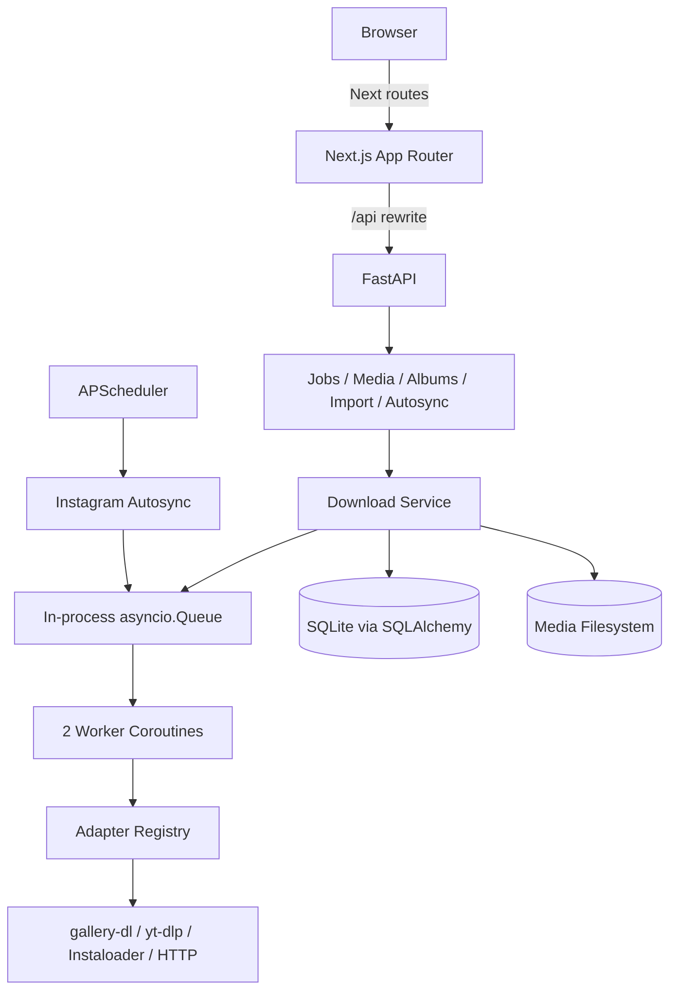

# Optimization Report

## 1. Executive Summary

MediaVault adalah aplikasi self-hosted untuk mengunduh, mengarsipkan, mengelola, dan mengekspor media sosial. Stack aktualnya adalah modular monolith Python/FastAPI dengan SQLAlchemy dan SQLite, worker `asyncio.Queue` in-process, APScheduler untuk autosync, serta frontend Next.js App Router/React/Tailwind. Fitur utama telah tersedia: unduhan multi-platform, job queue, deduplikasi URL/hash, vault media, album, favorite, import arsip, export CSV/JSON/ZIP, adapter health, dan Instagram saved-post autosync.

Kekuatan utama: pemisahan route/service/adapter cukup jelas; registry adapter mudah diperluas; operasi blocking dipindah ke thread; path media serving memiliki containment check; frontend menggunakan strict TypeScript, memoization, polling overlap guards, dan build produksi berhasil.

Status incremental setelah implementasi Quick Wins, P0, P1/P2, P3, dan remediation lanjutan P0/P1:

1. **Resolved for single-user token model:** API token wajib dikonfigurasi; Bearer auth melindungi `/api/*`, kecuali `GET /api/health` dan `OPTIONS` (`backend/app/main.py:73-104`). Frontend menyertakan token melalui `apiFetch` dan `NEXT_PUBLIC_API_TOKEN`.
2. **Resolved for current HTTP download paths:** Central validator aktif; redirect target divalidasi ulang dan TikTok fallback memakai guarded public opener (`backend/app/url_validation.py`; `backend/app/adapters/tiktok.py`). Connection-time DNS pinning native engines tetap limitation.
3. **Resolved:** Next.js `16.3.3`, React `19.2.1`; `npm audit --omit=dev` reports 0 vulnerabilities.
4. **Resolved for SQLite-backed recovery:** atomic claims, leases, startup recovery, process-death recovery, retry limits, and queue/job metrics added (`backend/app/db.py`, `backend/app/service.py`, `backend/app/main.py`, `backend/app/observability.py`).
5. **Partially Resolved:** staged download and compensating cleanup added; filesystem and DB still lack a single true transaction boundary (`backend/app/service.py`, `backend/app/routes/media.py`).
6. **Resolved:** Upload/list/batch/export memiliki caps; ZIP kini disk-backed dan recursive parser memiliki depth/node/record caps (`backend/app/config.py`; `backend/app/importer.py`; `backend/app/routes/media.py`).
7. **Resolved:** Test memakai temporary DB/media melalui `conftest.py:7-20`; auth, queue, migration, dan bounds regression tests tersedia; `pytest` menghasilkan 21 passed + 5 subtests.
8. **Resolved:** `sync_liked` yang belum berfungsi dihapus dari API/UI dan dipaksa false untuk kompatibilitas DB (`backend/app/routes/autosync.py`; `backend/app/autosync.py`; `AutoSyncCard.tsx`).
9. **Resolved:** Physical path dan raw job errors tidak lagi keluar melalui API; CSV dan ZIP output disanitasi (`backend/app/routes/jobs.py`; `backend/app/routes/media.py`).
10. **Partially Resolved:** P0-P3 remediation tervalidasi; `config/cookies.bak` sudah dihapus dari workspace/index, tetapi credential rotation dan Git history review tetap diperlukan.

Rekomendasi keseluruhan: **jangan rewrite**. P0 dependency/auth sudah tervalidasi. Sisa prioritas: rotate/purge cookie history, native-engine DNS pinning, true filesystem/DB reconciliation, idempotency race tests, frontend test coverage, typed errors, dan production deployment decision.

## 2. Audit Metadata

| Item | Value |
|---|---|
| Audit Date | 2026-08-26 |
| Repository | MediaVault (`mediavault`) |
| Branch | `master` |
| Commit | `a4157eab84b8753fd277122e3ae692487a532786` |
| Auditor | Codebase Architect & Optimization Auditor |
| Audit Mode | Incremental implementation: Quick Wins QW-001 sampai QW-008, RM-001 sampai RM-023 |
| Status | Incremental P0-P3 completed; remaining partial/open items documented below |

Audit diperbarui setelah implementasi P0-P3. Validasi terbaru: `pytest` 21 passed + 5 subtests, frontend lint/typecheck/build passed, `npm audit --omit=dev` reports 0 vulnerabilities, `pip check` passed, `compileall` passed, dan `git diff --check` passed. Dua Python deprecation warnings tetap tercatat.

## 3. Technology Stack

| Category | Technology | Version | Evidence | Confidence |
|---|---|---:|---|---|
| Backend | Python | `>=3.11` | `pyproject.toml:5` | High |
| Backend framework | FastAPI + Uvicorn | `>=0.115`, `>=0.30` | `pyproject.toml:7-8`; app `backend/app/main.py:71-92` | High |
| ORM | SQLAlchemy | `>=2.0` | `pyproject.toml:9`; models `backend/app/db.py:49-155` | High |
| Scheduling | APScheduler | `>=3.10` | `pyproject.toml:12`; `backend/app/scheduler.py:38-50` | High |
| Validation/config | Pydantic Settings | `>=2.4` | `pyproject.toml:13`; `backend/app/config.py` | High |
| Encryption | cryptography/Fernet | `>=43` | `pyproject.toml:10`; `backend/app/vault.py:8-21` | High |
| Download engines | yt-dlp, gallery-dl, Instaloader | `>=2024.12`, `>=1.27`, `4.13` | `pyproject.toml:17-22`; `backend/app/engines.py` | High |
| Frontend | Next.js App Router | `16.3.3` | `frontend/package.json:12`; `frontend/src/app/` | High |
| UI runtime | React / React DOM | `19.2.1` | `frontend/package.json:13-14` | High |
| Styling | Tailwind CSS + PostCSS plugin | `^4.3.3` | `frontend/package.json:17,20`; `frontend/postcss.config.mjs:1-4` | High |
| Motion | Framer Motion | `^13.1.1` | `frontend/package.json:11`; component imports | High |
| Language/tooling | TypeScript | `5.7.2` | `frontend/package.json:21`; `frontend/tsconfig.json` | High |
| Database | SQLite default | SQLAlchemy driver | `.env.example:3`; `backend/app/db.py:163-174` | High |
| Queue | In-process `asyncio.Queue` | Runtime native | `backend/app/service.py:23-41`; `backend/app/worker.py:34-36` | High |
| Package management | pip/PEP 621, npm lockfile v3 | N/A | `pyproject.toml`; `frontend/package-lock.json:1-6` | High |
| Testing | pytest + unittest-style tests | pytest `>=8.0` declared | `pyproject.toml:23-25`; `tests/test_engines.py`; `backend/tests/test_autosync.py` | High |
| Local runtime | PowerShell/Bash scripts | N/A | `run-local.ps1`, `run-local.sh` | High |
| CI/CD | GitHub Actions | N/A | `.github/workflows/ci.yml` | High |
| Containers | Tidak ditemukan | N/A | Tidak ada Dockerfile/Compose/.dockerignore pada tracked files | High |

## 4. Architecture Overview

Arsitektur adalah **modular monolith lokal** dengan dua proses aplikasi:

- Next.js frontend menyediakan route `/` dan `/vault`, lalu mem-proxy `/api/*` ke FastAPI (`frontend/next.config.mjs:3-6`).
- FastAPI mendaftarkan router health, jobs, import, media, albums, adapters, dan autosync (`backend/app/main.py:81-87`).
- Request enqueue menulis row `Job`, lalu memasukkan job ID ke queue proses (`backend/app/routes/jobs.py:14-19`, `backend/app/service.py:58-75`).
- Dua worker mengambil ID, mengeksekusi download blocking via `asyncio.to_thread`, menulis file dan metadata, kemudian DB (`backend/app/main.py:62-64`, `backend/app/service.py:159-264`).
- Adapter registry memilih Instagram/X/Threads/YouTube/Reddit/Pinterest/TikTok (`backend/app/main.py:45-59`, `backend/app/adapters/registry.py:9-73`). Facebook ada tetapi dinonaktifkan (`backend/app/main.py:58`).
- APScheduler menjalankan autosync Instagram tiap menit (`backend/app/scheduler.py:38-50`).

Batas modul cukup baik di backend, tetapi route frontend dan beberapa backend route terlalu banyak memegang orchestration, query, state, dan error handling. Queue/DB/filesystem berada dalam satu proses tanpa transactional boundary terpadu.

## 5. Feature Inventory

| ID | Feature | Location | Status | Test Coverage | Risk |
|---|---|---|---|---|---|
| FEAT-001 | Single URL download | `backend/app/routes/jobs.py:14-19`; `frontend/src/components/studio/DownloadStudio.tsx` | Complete | None end-to-end | High |
| FEAT-002 | Multi-platform detection/adapters | `backend/app/adapters/registry.py:26-32`; `backend/app/main.py:45-59` | Complete, Facebook disabled | Partial engine-only | High |
| FEAT-003 | Background job queue | `backend/app/service.py`; `backend/app/worker.py` | Partial: SQLite durable recovery, no external queue | 1 claim/recovery test | High |
| FEAT-004 | URL/hash deduplication | `backend/app/service.py:95-104,167-197` | Partial: race/retry semantics flawed | None | High |
| FEAT-005 | Media vault/list/filter | `backend/app/routes/media.py:34-75`; `frontend/src/app/vault/page.tsx` | Complete | None | High |
| FEAT-006 | File serving | `backend/app/routes/media.py:113-139` | Complete | None | High |
| FEAT-007 | Favorite media | `backend/app/routes/media.py:142-157`; vault UI | Complete, batch semantics ambiguous | None | Medium |
| FEAT-008 | Media deletion/batch deletion | `backend/app/routes/media.py:159-260`; `frontend/src/app/vault/page.tsx:324-345` | Complete, batch endpoint corrected; filesystem/DB reconciliation partial | Backend coverage partial | High |
| FEAT-009 | Albums CRUD/membership | `backend/app/routes/albums.py:31-250`; `AlbumModal.tsx` | Partial: edit UI unreachable | None | Medium |
| FEAT-010 | Creator grouping/export | `backend/app/routes/media.py:245-333`; `CreatorsHub.tsx` | Complete | None | Medium |
| FEAT-011 | CSV/JSON/ZIP export | `backend/app/routes/media.py:336-539` | Complete, bounded/disk-backed ZIP | Partial bounds coverage | Medium |
| FEAT-012 | Archive import JSON/HTML/TXT | `backend/app/routes/importer.py:10-44`; `backend/app/importer.py` | Complete, unbounded upload | None | High |
| FEAT-013 | Instagram saved autosync | `backend/app/autosync.py:73-211` | Complete for saved posts | 5 partial tests | High |
| FEAT-014 | Liked-post autosync | `backend/app/db.py:145-147`; `backend/app/autosync.py:127-133` | Incomplete | Test does not assert liked behavior | Medium |
| FEAT-015 | Adapter health | `backend/app/scheduler.py:14-35`; adapters | Partial: checks return true | None | Medium |
| FEAT-016 | Session encryption helpers | `backend/app/vault.py:8-21`; `backend/cli.py:6-27` | Partial/unintegrated | None | Medium |
| FEAT-017 | Studio polling/job history | `frontend/src/app/page.tsx:52-150`; `JobPipeline.tsx` | Complete, inefficient | None | High |
| FEAT-018 | Vault search/filter/pagination | `frontend/src/app/vault/page.tsx:234-275`; `MediaGallery.tsx:108-143` | Complete, client-heavy | None | High |
| FEAT-019 | Import/adapter/modals/toasts | `frontend/src/components/modals/`; `JobNotificationToast.tsx` | Complete, accessibility gaps | None | Medium |
| FEAT-020 | Local startup automation | `run-local.ps1`; `run-local.sh` | Complete but inconsistent | None | Medium |

## 6. Feature Gap Analysis

| ID | Gap | Evidence | Confidence | Business Impact | Priority |
|---|---|---|---|---|---|
| GAP-001 | `sync_liked` tidak menjalankan liked sync | **Resolved:** field dihapus dari request/response API dan UI, update selalu memaksa DB legacy flag false (`backend/app/routes/autosync.py`; `backend/app/autosync.py:59-62`; `frontend/src/components/studio/AutoSyncCard.tsx`) | Confirmed | Kontrak sekarang hanya menjanjikan saved posts | Closed |
| GAP-002 | Autosync API tampak multi-platform, scheduler hardcode Instagram | `backend/app/routes/autosync.py:16-25`; `backend/app/scheduler.py:38-49` | Likely | Konfigurasi platform lain tidak berjalan periodik | P2 |
| GAP-003 | Album edit backend/modal ada tetapi trigger UI tidak ada | Handler `frontend/src/app/vault/page.tsx:440-455`; modal mode `AlbumModal.tsx:66-73`; tidak ada setter edit | Confirmed | Fitur mati dan kode membingungkan | P2 |
| GAP-004 | UI sidebar Google Photos/Vault tidak dipakai | Tidak ada runtime import; hanya type `AlbumSummary` diimpor dari `VaultSidebar` | Confirmed | Sekitar 960 LOC menambah beban maintenance | P2 |
| GAP-005 | Account DB dan vault encryption tidak terhubung ke adapter runtime | `backend/app/db.py:49-56`; `backend/app/vault.py`; session dibaca file pada `backend/app/main.py:45-52` | Likely | Model keamanan sesi belum selesai atau sudah obsolete | P2 |
| GAP-006 | Facebook adapter tersedia tetapi registration disabled | `backend/app/adapters/facebook.py`; `backend/app/main.py:58` | Requires Business Confirmation | Cakupan platform berbeda dari PRD | P3 |
| GAP-007 | Footer link dan carousel dot bersifat placeholder | **Resolved:** misleading controls removed (`frontend/src/app/page.tsx`) | Confirmed | Affordance menyesatkan | Closed |
| GAP-008 | Docker portability dijanjikan tetapi artefak deployment tidak ada | `PRD_MediaVault_Personal_Downloader.md:107-127`; tidak ada Dockerfile/Compose | Requires Business Confirmation | Deployment production tidak reproducible | P2 |
| GAP-009 | Tidak ada authentication/user/tenant model | Semua router tanpa dependency auth `backend/app/main.py:81-87` | Confirmed technical absence; requirement exposure Requires Business Confirmation | Aman hanya jika loopback-only | P0 |

## 7. Architecture Findings

| ID | Finding | Evidence | Impact | Recommendation | Priority |
|---|---|---|---|---|---|
| ARCH-001 | Queue in-process dan startup menghapus pending work | `backend/app/service.py:23-41`; `backend/app/main.py:26-44` | Job diterima dapat hilang saat restart; tidak bisa horizontal scale | Recover queued/running rows atau gunakan durable queue; jangan delete saat startup | P1 |
| ARCH-002 | File dan DB tidak satu failure boundary | Move/write sebelum DB commit `backend/app/service.py:202-249`; cleanup hanya temp `:251-259` | Orphan file/metadata dan retry inconsistency | Stage/finalize dengan compensating rollback dan integration tests | P1 |
| ARCH-003 | Delete disk dan DB non-atomic | `backend/app/routes/media.py:167-198,215-243` | File hilang tetapi row tersisa, atau sebaliknya | Tombstone/retryable cleanup atau compensating transaction | P1 |
| ARCH-004 | Route vault frontend terlalu besar | `frontend/src/app/vault/page.tsx:53-1084` | Sulit dites, coupling tinggi, regression surface luas | Extract API client dan hooks polling/filter/mutation secara incremental | P2 |
| ARCH-005 | Studio route mencampur API, polling, state, UI | `frontend/src/app/page.tsx:24-440` | Duplikasi pola dan error handling | Jadikan route composition boundary | P2 |
| ARCH-006 | Shared types dimiliki dead presentation module | `AlbumSummary` berasal dari `VaultSidebar.tsx`, dipakai page/modal | Dependency direction membingungkan | Pindahkan model murni jika komponen dead dihapus | P2 |
| ARCH-007 | Packaging/import Python tidak konsisten | `backend/cli.py:3` memakai `app.vault`; `backend/init_db.py:3` memakai `backend.app` | Eksekusi tergantung cwd/PYTHONPATH | Standardisasi package entry points | P3 |
| ARCH-008 | Framework frontend lama tetapi arsitektur App Router valid | `frontend/package.json:12`; `frontend/src/app/` | Upgrade perlu tetapi rewrite tidak perlu | Migrasi terencana ke versi patched supported | P0 |

## 8. Code Quality Findings

| ID | Finding | Location | Evidence | Impact | Recommendation | Priority |
|---|---|---|---|---|---|---|
| CQ-001 | Broad exception swallowing | Backend routes/service/adapters | `service.py:69-73,136-141`; `media.py:89-96,172-191`; `threads.py:335-360` | Partial failure tersembunyi | Tangkap exception spesifik, log context, laporkan partial result | P1 |
| CQ-002 | Ad-hoc migration menelan semua error | `backend/app/db.py:185-203` | `ALTER TABLE` dibungkus bare catch tanpa log | Schema drift tidak terlihat | Versioned migration; rethrow unexpected failure | P1 |
| CQ-003 | Raw exception dijadikan public error | **Resolved for audited job/import paths:** internal error tetap tersimpan tetapi response memakai `Job failed`; importer memakai stable message (`jobs.py:_public_job_error`; `importer.py:20-25`) | Info leakage berkurang | Pertahankan pola untuk endpoint baru | Closed |
| CQ-004 | Duplikasi platform icon mapping | Lima frontend component | `JobPipeline.tsx:67-87`; `CreatorsHub.tsx:35-54`; `MediaGallery.tsx:40-92` | Style/alias drift | Extract stable platform metadata helper | P3 |
| CQ-005 | Duplikasi pagination algorithm | `JobPipeline.tsx:117-132`; `MediaGallery.tsx:94-106` | Implementasi paralel | Bug fix ganda | Extract pure tested helper | P3 |
| CQ-006 | Dead imports/naming/time helper | Backend | `db.py:9-15,45-46`; `main.py:8,58`; `vault.py:3` | Noise dan timezone confusion | Tambahkan lint, hapus dead code, rename helpers | P3 |
| CQ-007 | Batch favorite adalah toggle, bukan target state | `frontend/src/app/vault/page.tsx:373-381` | Mixed selection dibalik per item | Data state tidak sesuai intent label | Endpoint/action explicit set/unset favorite | P2 |
| CQ-008 | Mutation failure frontend sering diam | `frontend/src/app/page.tsx:180-213`; vault handlers `:290-487` | Non-OK sering tidak menghasilkan feedback | UX tidak dapat dipercaya | Typed API helper + contextual user errors | P1 |
| CQ-009 | `Icons.tsx` adalah SVG hand-rolled besar | `frontend/src/components/ui/Icons.tsx:3-493` | Satu file memuat seluruh icon implementation | Maintenance/a11y/style cost | Evaluasi satu maintained icon family, migrasi bertahap | P3 |

## 9. Performance Findings

| ID | Area | Finding | Evidence | Impact | Recommendation | Priority |
|---|---|---|---|---|---|---|
| PERF-001 | Backend DB | Confirmed N+1 pada media, creators, export, albums | `media.py:51-55,251-288,366-369,409-413,471-478`; `albums.py:35-60,117-121` | Latency/query count linear | select-in/join/group aggregation dan query-count tests | P1 |
| PERF-002 | Database | Index dominan tidak ada | Schema `db.py:59-155`; filter `jobs.py:28-49`, `media.py:43-49` | Table scan saat vault tumbuh | Tambah index via migration setelah query profiling | P1 |
| PERF-003 | Export | **Partially Resolved:** item/ID/total-byte caps diterapkan, tetapi ZIP masih dibangun di `BytesIO` | `config.py:15-22`; `media.py:export_media_zip` | Cap mencegah export tak terbatas; memory tetap sebesar configured cap | Temp-file/streaming ZIP tetap P1 | P1 |
| PERF-004 | Import | **Partially Resolved:** upload dibaca `max_upload_bytes + 1` dan oversized ditolak 413; recursive JSON depth/node cap belum ada | `routes/importer.py:19-25`; `backend/app/importer.py:40-73` | Memory bounded, CPU/depth masih perlu hardening | Tambah depth/record/time cap | P2 |
| PERF-005 | Frontend vault | 1,500 media + 6 endpoint lain setiap 5 detik, sequential | `frontend/src/app/vault/page.tsx:99-179,209-214` | Network, backend, battery, stale cycles | Server pagination; poll hanya volatile status; concurrent safe GET | P1 |
| PERF-006 | Frontend studio | Hingga 1,000 jobs setiap 3 detik | `frontend/src/app/page.tsx:58,148`; `JobPipeline.tsx:151-189` | Beban tumbuh dengan history | Active/recent poll + paginated history; SSE bila layak | P1 |
| PERF-007 | Batch favorite | Satu PATCH per selected item tanpa concurrency cap | `frontend/src/app/vault/page.tsx:373-381` | Burst hingga dataset penuh | Batch endpoint atau bounded concurrency | P2 |
| PERF-008 | Media cards | Raw `` tanpa intrinsic dimensions | `page.tsx:333`; `MediaGallery.tsx:228`; `CreatorsHub.tsx:263` | CLS/transfer optimization lemah | Dimensions/sizes/poster metadata; evaluasi `next/image` | P2 |
| PERF-009 | Video cards | `preload="metadata"` hingga 150 card | `MediaGallery.tsx:38,220-226` | Banyak range request | Poster thumbnails; load video di lightbox/near viewport | P2 |
| PERF-010 | Storage metrics | Full recursive stat setiap request | `backend/app/routes/media.py:78-96` | Disk I/O linear | Cache singkat atau persisted aggregate | P2 |

## 10. Security Findings

| ID | Severity | Category | Finding | Evidence | Recommendation | Priority |
|---|---|---|---|---|---|---|
| SEC-001 | Critical when network-exposed | Broken Access Control, CWE-306/862 | **Resolved for single-user token model:** `API_TOKEN` fail-closed; Bearer auth protects `/api/*`, except health/OPTIONS; local paths remain loopback | `backend/app/main.py:73-104`; `frontend/src/lib/api.ts`; `backend/tests/test_auth.py` | Multi-user authorization, CSRF, and Origin policy remain before shared deployment | P0 |
| SEC-002 | High | SSRF, CWE-918 | **Resolved for HTTP fallback paths:** strict validator plus redirect revalidation and public-DNS opener | `backend/app/url_validation.py`; `backend/app/adapters/tiktok.py`; `backend/tests/test_url_validation.py` | Native yt-dlp/gallery-dl connection-time DNS pinning remains limitation | P1 |
| SEC-003 | High | Vulnerable Components, OWASP A06 | **Resolved:** Next `16.3.3`, React `19.2.1`; `npm audit --omit=dev` reports 0 vulnerabilities | `frontend/package.json`; `frontend/package-lock.json` | Re-run audit during dependency updates | Closed |
| SEC-004 | High | Secret hygiene, CWE-312/540 | **Partially Resolved:** `config/cookies.bak` removed from workspace/index and backup pattern ignored; credential rotation/history review pending | `.gitignore`; Git index/history review required | Rotate sessions; purge historical secret if present | P0 |
| SEC-005 | Medium | Resource Exhaustion, CWE-400/770 | **Partially Resolved:** configured upload/list/batch/export caps diterapkan; recursive parser dan in-memory ZIP tetap open | `config.py:15-22`; importer/jobs/media routes; tests `test_backend_bounds.py` | Temp-file ZIP dan parser complexity cap | P1 |
| SEC-006 | Medium | Information Exposure, CWE-209/200 | **Resolved:** media response tidak mengirim `path`; job/import response tidak mengirim raw exception | `media.py:list_media`; `jobs.py:_public_job_error`; `importer.py:20-25` | Pertahankan stable public errors | Closed |
| SEC-007 | Medium | CSV Injection, CWE-1236 | **Resolved:** formula-leading cells dinetralkan pada standalone dan ZIP CSV | `media.py:neutralize_csv_formula`; `test_backend_bounds.py:15-18` | Pertahankan sanitizer test | Closed |
| SEC-008 | Medium | Archive Path Traversal, CWE-22 | **Resolved:** conservative component sanitizer dan item-ID prefix diterapkan | `media.py:sanitize_zip_component,export_media_zip`; `test_backend_bounds.py:20-23` | Pertahankan ZIP entry regression tests | Closed |
| SEC-009 | Medium contextual | CSRF, CWE-352 | State-changing browser requests tanpa CSRF | frontend mutation handlers; backend write routes | Tambah SameSite/Origin/CSRF bersama cookie auth | P1 |
| SEC-010 | Low | Cryptographic config, CWE-798/321 | Default vault key placeholder; Windows menyalin apa adanya | `backend/app/config.py:9-10`; `.env.example:2`; `run-local.ps1:30-33` | Fail fast pada missing/placeholder/malformed key | P2 |
| SEC-011 | Low | Unsafe development exposure | **Resolved for local scripts/direct run:** backend/frontend/CORS/launcher menggunakan `127.0.0.1` | `backend/app/main.py:73,96`; `frontend/package.json:6`; run scripts | Production exposure tetap membutuhkan TLS/auth | Closed |
| SEC-012 | Informational | CORS | Origin localhost explicit, tetapi bukan access control | `backend/app/main.py:74-79` | Pertahankan allowlist per environment | P3 |

Catatan: isi `.env`, cookies, dan secret files tidak dicetak atau disalin ke report.

## 11. Testing & Quality Assurance

| ID | Area | Current State | Gap | Risk | Recommendation | Priority |
|---|---|---|---|---|---|---|
| TEST-001 | Test isolation | **Resolved:** root `conftest.py` menetapkan temporary SQLite/media sebelum app import dan dispose engine saat session selesai | `conftest.py:7-20`; 18 tests passed tanpa cleanup error | Data proyek tidak disentuh | Pertahankan guard | Closed |
| TEST-002 | Environment | **Resolved:** test extra mencakup gallery-dl, pytest config memiliki testpaths, `.[engines,test]` berhasil dipasang | `pyproject.toml:17-29` | Suite runnable | Tambah lock/constraints masih P1 | Closed |
| TEST-003 | Autosync behavior | **Partially Resolved:** kontrak liked dihapus dan diuji 422; saved behavior diuji; interval/error/concurrency coverage masih kosong | `backend/tests/test_autosync.py` | False promise ditutup | Tambah remaining branch tests | P2 |
| TEST-004 | Engines | 3 tests gallery-dl behavior | yt-dlp, no-file, error, concurrency branches tidak dites | Download regressions | Tambah unit tests dengan fake engine/filesystem | P1 |
| TEST-005 | Backend routes | Jobs/media/albums/import/delete/export tanpa tests | Critical workflows tidak terlindungi | Data loss/security regression | Integration tests dengan temp DB/media | P1 |
| TEST-006 | Worker/queue | Tidak ada tests restart/recovery/race | Semantics high-risk tidak terbukti | Job loss/duplication | Deterministic queue/service tests | P1 |
| TEST-007 | Frontend | Tidak ada test/spec files dan scripts | Polling, mutation, filters, dialogs tidak terlindungi | UI regression | Add Vitest/RTL atau framework compatible; E2E critical flow | P2 |
| TEST-008 | Static quality | **Partially Resolved:** explicit `typecheck` script ditambahkan dan lolos; build lolos; lint/frontend test runner belum tersedia | `frontend/package.json:5-10`; validation commands | CI bisa memanggil typecheck/build | Tambah lint/test saat dependency dipilih | P2 |
| TEST-009 | Coverage | Tidak ada coverage config/threshold | Unknown coverage | Prioritas sulit diukur | Coverage setelah isolation, fokus risk-based | P3 |

Command evidence:

- `npm run build`: **pass**, routes `/`, `/_not-found`, `/vault` static generated; First Load JS sekitar 159-160 kB.
- `.venv\Scripts\python.exe -m pip check`: **pass**, no broken requirements.
- Backend pytest: **pass**, 21 tests + 5 subtests; 7 warnings (dependency/runtime deprecations) dicatat.
- P3 validation: frontend lint **pass**, typecheck **pass**, production build **pass**, `git diff --check` **pass`.
- Latest validation: `pytest` **22 passed**, `compileall` **pass**, `pip check` **pass**, `npm audit --omit=dev` **0 vulnerabilities**, frontend lint/typecheck/build **pass**. Seven Python/runtime deprecation warnings remain.
- Bug-fix validation: batch delete route corrected to `/api/media/batch-delete`; audio files excluded from media API responses; Pinterest author fallback added.
- `igfeaturefix` validation: Instagram classifier, secure login/2FA challenge, truthful session status, disconnect, CLI session import, Instagram-only engine preference, category-aware retry, and duplicate-queue protection implemented; `pytest` 25 passed + 5 subtests, compileall/pip check/lint/typecheck/build passed. Nine warnings remain.

## 12. Dependency Audit

| Dependency | Current Version | Finding | Risk | Recommendation | Priority |
|---|---:|---|---|---|---|
| Next.js | `16.3.3` | Current audit reports no vulnerabilities | Low | Re-run audit during dependency updates | Closed |
| PostCSS | Patched transitively via current Next toolchain | `npm audit --omit=dev` reports 0 vulnerabilities | Low | Re-run audit during dependency updates | Closed |
| Python runtime deps | Lower bounds only | Tidak reproducible; behavior dapat drift | High | Generate reviewed lock/constraints untuk Python target | P1 |
| yt-dlp/gallery-dl | Open lower bounds | Site-sensitive engine churn | Medium-High | Lock tested versions, jadwalkan controlled updates | P1 |
| Instaloader | `4.13` exact | Reproducible tetapi perlu compatibility monitoring | Medium | Keep tested; update only with adapter tests | P2 |
| pytest | `>=8.0` optional; validated `9.1.1` | **Resolved:** test extra mencakup gallery-dl dan suite collect/run berhasil | Low | Lock tested dependency set masih direkomendasikan | P3 |
| Framer Motion | `^13.1.1` | Lockfile reproducible; package name legacy vs Motion branding | Low | Tidak perlu migrasi kecuali manfaat bundle/API jelas | P3 |
| Tailwind CSS | `^4.3.3` | Lockfile ada, integration valid | Low | Keep; audit upgrades normally | P3 |
| TypeScript | `5.7.2` | Exact but old relative ecosystem date | Medium | Upgrade bersama Next, validate strict build | P2 |
| Node runtime | Tidak dideklarasikan | `@types/node` 26 dapat berbeda dari runtime | Medium | Tambah `engines`/`.nvmrc`/Volta contract | P2 |
| Hatchling | Unbounded build requirement | Build backend drift | Low-Medium | Pin tested build tool in lock/constraints | P3 |

## 13. Database Audit

| ID | Area | Finding | Evidence | Impact | Recommendation | Priority |
|---|---|---|---|---|---|---|
| DB-001 | Constraints | SQLite FK enforcement active | `db.py` connection setup | Orphan rows reduced | Retain regression test | Closed |
| DB-002 | Indexes | Dominant query indexes added | `db.py` versioned migration | Table scans reduced | Validate with production query plans | P1 |
| DB-003 | Migrations | Lightweight versioned SQLite migrations active | `db.py` migration runner | Drift risk reduced | Add rollback/backup procedure before production | P2 |
| DB-004 | Job idempotency | Check dan insert beda transaksi, tanpa unique active URL | `service.py:93-134`; `db.py:59-69` | Duplicate race | DB-backed idempotency constraint/transaction | P1 |
| DB-005 | Retry semantics | Semua status job menghalangi duplicate URL | `service.py:95-104` | Failed download sulit retry | Dedupe active/success states sesuai policy | P1 |
| DB-006 | Time | Runtime timestamps normalized to aware UTC; persisted legacy values need migration assessment | `db.py`; API jobs | Historical ordering ambiguity | Migrate/verify existing timestamps | P2 |
| DB-007 | Media identity | Hanya first file hash menentukan duplicate | `service.py:189-197` | Multi-file collision semantics | Business confirmation: source/full-set/asset identity | P2 |
| DB-008 | Account/session model | Account encrypted session tidak dipakai runtime | `db.py:49-56`; `main.py:45-52` | Dead schema/security confusion | Integrate atau migrate-remove setelah confirmation | P2 |

## 14. API & Integration Audit

| ID | Integration | Finding | Evidence | Risk | Recommendation | Priority |
|---|---|---|---|---|---|---|
| API-001 | Public API | Bearer auth aktif; versioning dan rate limits masih belum lengkap | `main.py:80-88`; routes | Medium | Stable `/api/v1` dan rate limiting bila external deployment diperlukan | P1 |
| API-002 | URL ingestion | **Partially Resolved:** canonical URL validator aktif sebelum enqueue/worker; redirect/connection-time DNS controls belum ada | `url_validation.py`; `service.py` | Medium-High residual | Lengkapi transport-level redirect/DNS validation | P1 |
| API-003 | TikTok/TikWM | URL user dikirim ke third-party fallback | `backend/app/adapters/tiktok.py:29-41` | Privacy/compliance | Requires Business Confirmation; disclose/disable/configure | P1 |
| API-004 | Error contract | HTTPException, status dict, raw job errors tidak konsisten | Jobs/import/autosync routes | Medium | Typed error envelope + public codes | P1 |
| API-005 | Pagination | **Partially Resolved:** bounds diterapkan; history/media masih client-heavy dan belum cursor/offset pagination | jobs/media routes; frontend polling | Medium | Tambah real pagination contract | P1 |
| API-006 | Rate limiting | Decorator ada tetapi tanpa call site | `ratelimit.py:19-43`; two workers `main.py:62-64` | Account bans/throttling | Per-platform serialized limiter + backoff | P1 |
| API-007 | Health | Adapter health dan `/health` selalu positif | `health.py:6-8`; adapter `health()` methods | False readiness | Pisahkan liveness/readiness, DB/tool/session checks | P2 |
| API-008 | Autosync concurrency | Manual dan scheduler dapat overlap tanpa lock | `autosync route:75-82`; `scheduler.py:38-49` | Duplicate/upstream burst | Per-platform lock/lease | P2 |
| API-009 | Frontend proxy | Backend origin hardcoded localhost | `frontend/next.config.mjs:3-6` | Deploy portability | Validated server-only environment setting | P2 |
| API-010 | Frontend request handling | Timeout tidak konsisten; vault sequential | Studio timeout `page.tsx:55-58`; vault `:99-179` | Stalled refresh | Shared request helper + timeout; safe GET parallelism | P2 |

## 15. Observability Audit

| Area | Current State | Gap | Risk | Recommendation |
|---|---|---|---|---|
| Logging | JSON logging configured; worker/autosync events logged | Redaction policy and centralized log shipping absent | Incident diagnosis limited | Add redaction, retention, centralized sink when deployed |
| Correlation | Request correlation ID middleware active | Job/adapter propagation remains incomplete | Partial tracing | Propagate ID through queue and adapter logs |
| Metrics | Request, queue depth, job duration/status/retry metrics available | Export/adapter latency and persistence/retention absent | Degradasi masih terbatas | Add durable metrics backend when deployed |
| Tracing | Tidak ditemukan | External engine/API latency opaque | Bottleneck sulit dibuktikan | Optional OpenTelemetry setelah logging/metrics |
| Health | Liveness plus `/api/health/ready` readiness endpoint added | Adapter/session checks remain limited | False green risk reduced | Expand dependency checks for deployment |
| Alerting | Tidak ditemukan | Failure scheduler/download tidak memicu alert | Silent outage | Error tracking/alert threshold sesuai deployment |
| Audit trail | Job status/error dan autosync counters disimpan | Destructive actions tidak diaudit | Tidak bisa atribusi/restore | Audit event untuk delete/export/config setelah auth |
| Frontend telemetry | Console errors dan user toasts | Tidak ada error tracking/Web Vitals | Browser failure tidak diketahui | Lightweight error/Web Vitals collection bila deployed |

## 16. Technical Debt

| ID | Technical Debt | Evidence | Impact | Effort | Priority |
|---|---|---|---|---|---|
| TD-001 | Single-user token auth; no multi-user authorization | `backend/app/main.py:80-88` | Shared deployment limitation | Medium | P2 |
| TD-002 | Residual redirect/DNS SSRF hardening | Central prevalidation sudah ada; transport controls belum | High residual | Medium | P1 |
| TD-003 | Frontend vulnerability chain | `npm audit --omit=dev` 0 vulnerabilities | Low | Low | Closed |
| TD-004 | Secret backup tracked | `config/cookies.bak` | High credential risk | Low-Medium | P0 |
| TD-005 | SQLite-backed queue lacks external multi-process broker | `service.py`; `db.py` claims/leases | Medium deployment scalability | Medium-High | P2 |
| TD-006 | DB/filesystem divergence risk | service/delete flows | High data integrity | Medium | P1 |
| TD-007 | No real migration/index strategy | `db.py:185-203` | High scalability/reliability | Medium | P1 |
| TD-008 | N+1 query portfolio | media/albums/export routes | High scaling cost | Medium | P1 |
| TD-009 | Backend coverage masih tipis | Isolation/runnability resolved; worker/delete/export coverage masih kurang | Medium delivery risk | Medium | P2 |
| TD-010 | Polling whole datasets | frontend route polling | High runtime cost | Medium | P1 |
| TD-011 | Residual in-memory ZIP/parser complexity | Endpoint caps resolved; ZIP/temp streaming dan recursive parser cap open | Medium availability risk | Medium | P1 |
| TD-012 | Oversized frontend routes/dead UI | vault/studio route and unused sidebars | Medium maintenance | Medium | P2 |
| TD-013 | No CI/lock/Node contract | manifests/repo files | Medium DX/reproducibility | Medium | P2 |
| TD-014 | Observability blind spots | no config/metrics/tracing | Medium ops risk | Medium | P2 |
| TD-015 | Cross-platform script inconsistency | `run-local.ps1`, `run-local.sh` | Medium DX/runtime risk | Low-Medium | P2 |

## 17. Quick Wins

### QW-001 — Enforce loopback-only until authentication exists
**Status:** Resolved  
**Validation:** Backend direct run, CORS, Next dev server, PowerShell, dan Bash launcher memakai `127.0.0.1`. Frontend build passed.

### QW-002 — Central strict URL validator
**Status:** Resolved for HTTP fallback paths; native engine DNS pinning remains open  
**Validation:** `backend/app/url_validation.py` memvalidasi HTTPS, approved exact host, credentials, port, dan public DNS. Endpoint invalid URL mengembalikan 422. Unit tests validator passed.  
**Validation:** Redirect targets revalidated by `open_public_url`; TikTok API/image/video fallback uses guarded opener. Native yt-dlp/gallery-dl transport DNS pinning remains limitation.

### QW-003 — Isolate test DB and media root
**Status:** Resolved  
**Validation:** `conftest.py` membuat temp DB/media sebelum import dan dispose engine saat teardown. `pytest`: 18 passed, 5 subtests passed, tanpa cleanup error.

### QW-004 — Add request/query/batch bounds
**Status:** Partially Resolved  
**Validation:** Settings dan FastAPI/Pydantic caps diterapkan; oversized upload menghasilkan 413; invalid/oversized query/batch menghasilkan 422; tests passed.  
**Remaining:** ZIP masih in-memory walau byte-capped; recursive JSON complexity belum capped.

### QW-005 — Remove internal paths and raw errors from responses
**Status:** Resolved  
**Validation:** Physical `path` dihapus dari media list; job errors menjadi stable public message; importer tidak memantulkan exception. Backend tests passed.

### QW-006 — Correct autosync contract
**Status:** Resolved  
**Validation:** `sync_liked` dihapus dari API/UI, unknown field ditolak 422, legacy DB value dipaksa false. Autosync regression tests passed.

### QW-007 — Add canonical quality scripts
**Status:** Partially Resolved  
**Validation:** Python test extra dan pytest testpaths bekerja; frontend `lint`, `typecheck`, dan build scripts passed; `pytest` 20 passed. Lint reports 6 existing warnings.  
**Remaining:** Frontend test runner dan Python lock masih open.

### QW-008 — Sanitize CSV and ZIP output names
**Status:** Resolved  
**Validation:** Formula-leading CSV cells dinetralkan; ZIP components memakai conservative sanitizer dan item ID prefix; unit tests passed.

## 18. Strategic Improvements

1. **Security boundary program:** authentication, authorization, CSRF/Origin policy, audit trail, secure session storage, and secret rotation. Do this before any shared/network deployment.
2. **Reliable job lifecycle:** durable queue or DB-backed claim/lease state; restart recovery; idempotency keys; retry policy; per-platform concurrency/rate limiting.
3. **Data integrity boundary:** staged downloads, compensating rollback, tombstone-based deletes, reconciliation job between DB and filesystem.
4. **Database maturity:** Alembic/versioned migrations, FK enforcement, measured indexes, eager-loading strategy, query-count regression tests.
5. **API contract evolution:** bounded pagination/filtering, typed error envelope, batch mutations, optional event stream for active jobs.
6. **Frontend state decomposition:** API client plus focused hooks; server-side pagination; poll only active state; accessible dialog/card/live-region primitives.
7. **Testing strategy:** isolated backend integration tests first, then worker/failure/race tests, frontend component tests, and one E2E download-to-vault workflow with fake adapters.
8. **Supply-chain reproducibility:** Python lock/constraints, Node version contract, patched frontend framework, dependency scanning in CI.
9. **Operational readiness:** structured logs, readiness, metrics, backup/restore runbook, production process/container only if deployment requirement remains.

## 19. Prioritized Roadmap

### P0 — Critical

- **RM-001: Add authentication/authorization before network exposure. Resolved:** API_TOKEN startup fail-closed plus bearer middleware protects `/api` except GET `/api/health` and OPTIONS; frontend uses NEXT_PUBLIC_API_TOKEN. Impact High, Effort Medium, regression risk Medium.
- **RM-002: Complete SSRF defense. Resolved for HTTP fallback paths:** redirect targets revalidated and public DNS enforced; native engine DNS pinning remains limitation.
- **RM-003: Resolved:** Next.js `16.3.3`, React `19.2.1`; `npm audit --omit=dev` reports 0 vulnerabilities; lint/typecheck/build passed.
- **RM-004: Partially Resolved:** `config/cookies.bak` removed from workspace/index and backup pattern ignored; credential rotation and Git history review remain required.
- **RM-005: Make tests impossible to run against active DB. Resolved:** disposable DB/media fixture and auth tests validated; `pytest` 20 passed.

### P1 — High

- **RM-006: Resolved for SQLite-backed recovery:** atomic claims, leases, startup/process-death recovery, retry limits, and metrics added. Validation: `pytest` 21 passed.
- **RM-007: Partially Resolved:** staged downloads and compensating cleanup added; true filesystem/DB reconciliation remains open. Validation: `pytest` 21 passed.
- **RM-008: Resolved:** disk-backed ZIP and recursive parser complexity caps added. Validation: `pytest` 21 passed. Impact Medium-High, Effort Medium, regression risk Low.
- **RM-009: Partially Resolved:** SQLite FK enforcement and indexes added; versioned migrations remain open. Validation: `pytest` 20 passed.
- **RM-010: Partially Resolved:** obvious route N+1 paths reduced; query-count benchmark remains open. Validation: `pytest` 20 passed.
- **RM-011: Partially Resolved:** category-aware retry and network backoff added; DB atomic claim prevents concurrent processing. Cross-process idempotency stress test remains open. Validation: `pytest` 22 passed.
- **RM-012: Resolved for current list flows:** offset pagination and active/recent polling added. Validation: typecheck/build passed.
- **RM-013: Partially Resolved:** lightbox dialog semantics and focusable controls added; full modal/card/live-region audit remains open. Validation: lint/typecheck/build passed.
- **RM-014: Partially Resolved:** shared API error helper and mutation feedback added; batch-delete endpoint contract corrected and validated by frontend build. Full typed error envelope remains open. Validation: lint/typecheck/build passed.

### P2 — Medium

- **RM-015: Partially Resolved:** autosync contract saved-only; Instagram login/session classifier and actionable statuses hardened. Multi-platform saved sync requires business confirmation. Validation: `pytest` 22 passed.
- **RM-016: Partially Resolved:** JSON logging, request IDs, readiness, and basic request metrics added (`backend/app/observability.py`). Tracing/production metrics backend remain open. Validation: `pytest` 20 passed; frontend lint/typecheck/build passed.
- **RM-017: Partially Resolved:** CI workflow added for pytest, lint, typecheck, build, audit. CI audit remains blocked by 3 high dependency advisories. Validation: local checks passed except audit.
- **RM-018: Still Open:** no safe frontend split/dead UI removal performed; requires dedicated UI scope.
- **RM-019: Partially Resolved:** runtime timestamps normalized to UTC; migration of existing persisted timestamps remains open. Validation: `pytest` 20 passed.
- **RM-020: Resolved for current local path:** PowerShell/Bash launchers use consistent module/startup path. Production deployment contract remains undefined.

### P3 — Low

- **RM-021: Partially Resolved:** shared pagination helper added; TS target modernized to `es2017`; obvious duplicate pagination code removed. Platform icon deduplication/dead-import audit remains open. Validation: lint/typecheck/build passed.
- **RM-022: Resolved:** misleading carousel dots and fake footer links removed. Validation: typecheck/build passed.
- **RM-023: Partially Resolved:** mobile navbar overflow handling and font loading improved; media intrinsic dimensions/poster optimization remains open. Validation: lint/typecheck/build passed.

## 20. Recommended Next Actions

1. Review/rotate tracked cookie backup dan bersihkan Git history bila credential pernah tersimpan.
2. Select patched Next.js target; upgrade in isolated branch dan rerun build/audit.
3. Tambah authentication/authorization dan CSRF/Origin controls sebelum network exposure.
4. Lengkapi SSRF defense pada redirect dan connection-time DNS.
5. Tambah failure tests untuk queue restart, duplicate retry, file/DB rollback, deletes, uploads, dan exports.
6. Ganti startup job deletion dengan durable recovery.
7. Tambah migrations, FK enforcement, measured indexes, dan eager loading.
8. Ganti in-memory ZIP dengan temp-file/streaming dan batasi recursive parser complexity.
9. Tambah backend pagination/batch contracts, lalu sederhanakan frontend polling.
10. Tambah structured logs/readiness/metrics dan minimum CI gates.
11. Tambah frontend lint/test runner setelah tooling dipilih.
12. Re-run audit setelah P0/P1 berikutnya; tetap incremental mode.

## 21. Overall Score

| Dimension | Score |
|---|---:|
| Architecture | 59/100 |
| Code Quality | 58/100 |
| Security | 46/100 |
| Performance | 54/100 |
| Testing | 48/100 |
| Maintainability | 56/100 |
| Scalability | 34/100 |
| Observability | 25/100 |
| Documentation | 43/100 |
| Developer Experience | 55/100 |

Score incremental meningkat karena loopback containment, strict URL prevalidation, bounded inputs/exports, sanitized responses/exports, isolated runnable tests, dan explicit frontend typecheck. Security tetap rendah karena auth, redirect/DNS SSRF completion, vulnerable Next/PostCSS, dan tracked cookie backup masih open. Testing tetap terbatas pada 18 tests + 5 subtests; worker/queue/delete/export/frontend coverage masih rendah. Ini bukan production benchmark.

## 22. Audit Limitations

- Baseline audit bersifat static; run incremental ini mengimplementasikan Quick Wins yang disetujui. Tidak ada eksploitasi/dynamic penetration testing.
- Isi `.env`, `config/cookies.txt`, `config/cookies.bak`, dan secret/session values tidak dibaca atau dicetak. Status tracked file saja diperiksa.
- Backend tests dijalankan pada temporary DB/media: 18 passed, 5 subtests passed. Dua warning deprecation tetap open: Starlette TestClient/httpx dan Pydantic class-based Config.
- Frontend typecheck dan production build dijalankan dan berhasil; cache `.next` ignored dan `tsconfig.tsbuildinfo` tidak ditinggalkan.
- `npm audit --omit=dev` dijalankan setelah upgrade Next.js/React; hasil terbaru 0 vulnerabilities. Audit perlu diulang setiap dependency update.
- Tidak ada production metrics, traffic profile, data volume, SLO, backup history, deployment topology, atau incident history. Performance findings adalah code-path evidence, bukan latency benchmark.
- Tidak ada CI/CD/container/proxy config untuk dinilai.
- Generated/ignored directories seperti `.venv`, `node_modules`, `.next`, `data`, `media`, `logs`, caches, dan `graphify-out` tidak diaudit sebagai source code. Tracked sample media/metadata diinventaris tetapi binary image tidak dianalisis secara visual.
- Feature/business gaps terkait Facebook, Docker, account vault, autosync platform, dan UI dead components memerlukan product confirmation sebelum removal/implementation.
- Authentication priority bergantung exposure: P0 jika dapat dijangkau jaringan; jika dijamin loopback-only single-user, risikonya turun tetapi tetap menjadi blocker sebelum exposure.
