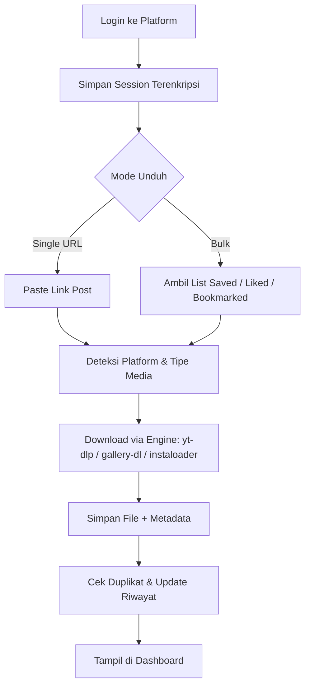

# PRD: MediaVault — Personal Social Media Downloader

| | |
|---|---|
| **Versi Dokumen** | 1.1 (Draft) — cakupan platform diperluas |
| **Tanggal** | 18 Agustus 2026 |
| **Pemilik Produk** | Kamu (single-user, proyek personal) |
| **Status** | Draft — menunggu validasi asumsi (lihat Bagian 18) |

## 1. Ringkasan

MediaVault adalah aplikasi **self-hosted** untuk mengunduh dan mengarsipkan media (foto, video, carousel/album) dari akun media sosial pribadi — mencakup Instagram, Facebook, X (Twitter), Threads, TikTok, YouTube, Reddit, Pinterest, dan platform lain lewat arsitektur adapter yang extensible — dengan kemampuan login memakai akun sendiri untuk mengakses konten yang disimpan (saved), disukai (liked), atau di-bookmark, selain unduhan per-URL biasa.

Dirancang untuk **satu pengguna**, dijalankan lokal atau di server pribadi (home server/NAS) — bukan layanan publik multi-user.

## 2. Latar Belakang & Masalah

- Konten yang disukai/disimpan tersebar di banyak platform dan sulit diakses offline.
- Post bisa hilang sewaktu-waktu — dihapus pembuatnya, akunnya di-private-kan, atau bahkan akun kamu sendiri kena suspend — sehingga "sudah disimpan" pun bukan jaminan.
- Belum ada satu tool matang yang mendukung banyak platform sekaligus (IG, FB, X, Threads, TikTok, dst.) dengan kontrol penuh atas kredensial di tangan pengguna sendiri — kebanyakan tool yang ada spesifik ke satu platform saja.

## 3. Tujuan & Non-Tujuan

### Tujuan
| ID | Tujuan |
|----|--------|
| G1 | Login ke akun pribadi (IG, X, Threads) dengan aman |
| G2 | Download media dari URL post tunggal |
| G3 | Bulk-download dari saved / liked / bookmarked posts |
| G4 | Media tersimpan rapi + metadata (caption, sumber, tanggal) |
| G5 | Berjalan lokal/self-hosted, kredensial aman |
| G6 | Arsitektur mudah diperluas ke platform baru (adapter/plugin) tanpa mengubah core logic |

### Non-Tujuan
- Bukan untuk redistribusi/download massal konten orang lain untuk tujuan komersial
- Bukan layanan publik multi-tenant/SaaS
- Tidak bertujuan membajak proteksi DRM konten berbayar

## 4. Target Pengguna

Single-user — kamu sendiri. Asumsi: cukup nyaman menjalankan Docker/command line (lihat Bagian 18 kalau ini tidak sesuai).

## 5. Ruang Lingkup Platform

Cakupan diperluas ke hampir seluruh platform media sosial utama. Supaya realistis, rollout dibagi per tier berdasarkan kematangan tooling — bukan dikerjakan sekaligus:

| Tier | Platform | Catatan |
|------|----------|---------|
| Tier 1 — tooling matang, effort rendah | Instagram, X (Twitter), YouTube, Reddit, Pinterest | Didukung penuh oleh gallery-dl/yt-dlp/instaloader, extractor paling stabil |
| Tier 2 — didukung, tapi lebih rapuh | Facebook, TikTok, Threads | Bisa dikerjakan dengan yt-dlp, tapi anti-bot lebih ketat & extractor lebih sering butuh update |
| Tier 3 — sulit/berisiko tinggi | LinkedIn, Snapchat | Minim tooling OSS reliable, risiko legal/ToS lebih tinggi, value media relatif rendah dibanding effort |

### 5.1 Analisis Kelayakan per Platform

| Platform | Engine | Tingkat Kesulitan | Catatan |
|----------|--------|--------------------|---------|
| Instagram | instaloader, gallery-dl | Rendah–Menengah | Paling matang, dukungan login untuk private/saved content |
| X (Twitter) | gallery-dl, yt-dlp | Rendah–Menengah | API resmi mahal (lihat Bag. 9) — pakai engine session-based |
| YouTube | yt-dlp | Rendah | Extractor paling stabil, sering disebut "gold standard" yt-dlp |
| Reddit | gallery-dl, yt-dlp | Rendah | Well-supported, API resmi juga relatif permisif |
| Pinterest | gallery-dl | Rendah | Well-supported untuk image/board |
| Threads | Pendekatan mirip IG | Menengah | API resmi gratis tapi fokus publish/insight, bukan retrieve saved list |
| Facebook | yt-dlp (video), gallery-dl (terbatas) | Menengah–Tinggi | Video publik cukup andal; akses konten login-based/private lebih rapuh, deteksi bot ketat |
| TikTok | yt-dlp | Menengah–Tinggi | Video publik andal, tapi anti-bot & signature berubah sangat sering; TikTok juga punya fitur ekspor data resmi yang bisa dimanfaatkan (lihat Bag. 9.1) |
| LinkedIn | Minim tooling OSS reliable | Tinggi | Riwayat agresif menindak scraper secara hukum; konten mayoritas teks/profesional, value media rendah |
| Snapchat | Nyaris tidak ada tooling OSS reliable | Sangat Tinggi | Konten didesain ephemeral by design, proteksi anti-automation sangat ketat |

Rekomendasi: kerjakan Tier 1 dulu (quick wins, effort rendah), lalu Tier 2. Untuk Tier 3 (LinkedIn, Snapchat), pertimbangkan dulu apakah worth it — value-nya kemungkinan tidak sebanding dengan effort & risiko dibanding platform lain. Detail rollout ada di Bagian 15 (Roadmap).

## 6. User Stories

- Sebagai pengguna, saya ingin login ke akun IG saya supaya aplikasi bisa mengakses saved collection saya.
- Sebagai pengguna, saya ingin paste link post X lalu klik "Download" agar media-nya otomatis tersimpan ke folder lokal.
- Sebagai pengguna, saya ingin sync berkala supaya post baru yang saya like otomatis terunduh.
- Sebagai pengguna, saya ingin melihat riwayat unduhan supaya tidak ada duplikat.
- Sebagai pengguna, saya ingin kredensial saya tersimpan terenkripsi, bukan plaintext.
- Sebagai pengguna, saya ingin bisa menambah platform baru di kemudian hari tanpa aplikasinya harus ditulis ulang dari nol.

## 7. Functional Requirements

### MVP — P0
| ID | Requirement |
|----|-------------|
| FR1 | Login & autentikasi per platform, session/cookie tersimpan terenkripsi |
| FR2 | Download single media dari URL, deteksi platform otomatis |
| FR3 | Simpan metadata: caption, username, tanggal, source URL, hashtag |
| FR4 | Organisasi file otomatis: `/media/{platform}/{username}/{tanggal}/` |
| FR5 | Riwayat unduhan + deteksi duplikat (by URL/hash) |
| FR6 | Queue & progress indicator |

### V1.1 — P1
| ID | Requirement |
|----|-------------|
| FR7 | Bulk import dari saved / liked / bookmarked list — via live-fetch (kalau didukung engine) atau import file JSON hasil "Download Your Data" resmi platform (direkomendasikan, risiko lebih rendah — lihat Bag. 9.1) |
| FR8 | Scheduled sync (cek berkala otomatis) |
| FR9 | Dashboard/gallery viewer untuk browse hasil unduhan |
| FR10 | Adapter registry — platform baru didaftarkan lewat interface standar tanpa mengubah core logic |
| FR11 | Health-check terjadwal per adapter (deteksi extractor rusak sebelum ketahuan pas dipakai) |

### V2 — P2
| ID | Requirement |
|----|-------------|
| FR12 | Browser extension companion (klik kanan → save) |
| FR13 | Export metadata ke JSON/CSV |
| FR14 | Notifikasi jika post yang sudah diunduh dihapus dari sumber asli |

## 8. Non-Functional Requirements

- **Keamanan** — kredensial & session terenkripsi at-rest; tidak ada data terkirim ke server pihak ketiga di luar platform asal.
- **Reliabilitas** — rate-limiting & retry logic agar tidak memicu flag dari platform.
- **Portabilitas** — dapat dijalankan via Docker di berbagai OS.
- **Performa** — proses download berjalan async, tidak memblokir UI.
- **Maintainability** — arsitektur modular per-platform ("adapter") dengan interface standar (list saved/liked, resolve URL, download media, cek status) agar platform baru bisa ditambah tanpa mengubah core logic, dan satu extractor yang rusak tidak menjalar ke platform lain.
- **Skalabilitas cakupan** — mengingat target mencakup hampir seluruh platform utama, masing-masing adapter idealnya punya versi engine, rate-limit config, dan health-check sendiri agar mudah dipantau satu-satu.

## 9. Arsitektur Teknis (Rekomendasi)

| Layer | Rekomendasi | Alasan |
|-------|-------------|--------|
| Backend | Python + FastAPI | Ekosistem library downloader (yt-dlp, gallery-dl, instaloader) mayoritas Python |
| Download Engine | yt-dlp (video — YouTube, TikTok, Facebook, X, IG Reels, dll.), gallery-dl (gambar/galeri — IG, X, Reddit, Pinterest, dll.), instaloader (khusus IG) | Sudah battle-tested & aktif di-maintain komunitas — jangan bangun scraper dari nol. Untuk platform video-heavy (TikTok, Facebook) yt-dlp jadi engine utama karena gallery-dl belum mencakup keduanya. |
| Task Queue | asyncio queue | Cukup untuk single-user, tanpa infra tambahan (Redis dkk) |
| Database | SQLite | Ringan, cukup untuk metadata single-user |
| Storage | Local filesystem | Kontrol penuh, tidak bergantung cloud |
| Frontend | React/Next.js (atau HTML+HTMX bila mau lebih ringan) | Dashboard untuk queue, gallery, dan pengaturan akun |
| Auth Storage | Encrypted local vault (`cryptography.Fernet` / OS keyring) | Kredensial tidak pernah plaintext |
| Deployment | Docker Compose, jalan lokal / home server / NAS | Hindari expose kredensial ke cloud pihak ketiga |

**Catatan soal API resmi vs. session-based** — per Agustus 2026, API resmi X memakai skema pay-per-use tanpa tier gratis yang memadai (~$0.005/read, batas ~2 juta read/bulan), dan tidak menyediakan endpoint khusus untuk "daftar post yang saya save/like". API Threads gratis, tapi didesain untuk publish/reply/insight, bukan retrieve saved list. Karena itu, engine berbasis session/login (gallery-dl, instaloader) tetap jadi pendekatan paling praktis untuk use case aplikasi ini dibanding integrasi API resmi.

### 9.1 Strategi Hybrid: Data Export Resmi + Download Engine

Untuk mengurangi risiko dari live-scraping daftar saved/liked secara berulang, MediaVault sebaiknya pakai pendekatan dua langkah di platform yang menyediakannya:

1. **Ambil daftar via fitur ekspor data resmi** — Instagram, X, dan TikTok semuanya punya fitur "Download Your Data"/"Download an Archive" (biasanya di Settings → Privacy/Account) yang menghasilkan file JSON/CSV berisi daftar lengkap post yang di-like, disimpan, atau di-bookmark, lengkap dengan link & timestamp — sepenuhnya lewat fitur resmi, tanpa automation sama sekali.
2. **Fetch media satu-per-satu via engine** — dari daftar URL hasil ekspor tadi, MediaVault baru menjalankan yt-dlp/gallery-dl/instaloader untuk mengunduh file media aktualnya. Pola trafficnya jadi tidak jauh beda dari pengguna biasa yang buka link satu-satu, jauh lebih ringan dibanding scraping endpoint saved/liked berulang kali.

Catatan: file ekspor data resmi biasanya cuma berisi *link*, bukan file media-nya — jadi langkah 2 tetap perlu. Beberapa video (terutama TikTok) juga tidak bisa diunduh kalau creator menonaktifkan opsi download di kontennya; MediaVault sebaiknya punya opsi default "skip" untuk kasus ini daripada memaksa lewat proteksi tersebut.

## 10. Alur Utama

## 11. Pertimbangan Legal, Etika & ToS

- Instagram, X, Threads, Facebook, TikTok, dan sebagian besar platform lain pada dasarnya melarang automated scraping/downloading di ToS masing-masing. Untuk penggunaan pribadi yang tidak agresif risikonya relatif rendah, tapi tetap ada kemungkinan akun kena rate-limit, challenge login, sampai suspend — dan levelnya bervariasi per platform (lihat Bagian 5.1). LinkedIn khususnya dikenal cukup agresif menindak aktivitas scraping secara hukum, jadi perlu pertimbangan ekstra sebelum dimasukkan ke scope.
- Mitigasi: gunakan strictly untuk arsip pribadi, hindari request volume besar dalam waktu singkat, tambahkan delay antar-request, dan pertimbangkan memakai akun terpisah (bukan akun utama) kalau kamu berencana melakukan sync yang cukup sering/agresif.
- Hormati hak cipta pembuat konten — mengunduh untuk konsumsi/arsip pribadi berbeda konteksnya dengan mendistribusikan ulang konten orang lain secara publik/komersial.
- Ini bukan nasihat hukum — kalau penggunaannya berkembang di luar arsip pribadi (mis. dipakai tim, dikomersialkan, atau di-deploy untuk banyak user), ada baiknya tinjau ulang ToS platform terkait atau konsultasi dengan yang lebih paham hukum di area ini.

## 12. Keamanan & Privasi

- Kredensial/session disimpan terenkripsi lokal, tidak pernah masuk version control (`.env` + `.gitignore`).
- Tidak ada analytics/telemetry eksternal.
- Kalau dijalankan di home server yang diakses banyak device, tambahkan layer auth lokal (password) untuk akses dashboard.

## 13. Metrik Keberhasilan

- Success rate download > 95% untuk URL valid di platform P0.
- Nol insiden akun kena flag/suspend akibat penggunaan aplikasi.
- Waktu rata-rata dari "paste URL" ke "file tersimpan" < 10 detik untuk media tunggal.

## 14. Risiko & Mitigasi

| Risiko | Dampak | Mitigasi |
|--------|--------|----------|
| Platform ubah struktur API/HTML | Fitur download berhenti berfungsi | Pakai library yang aktif di-maintain, arsitektur adapter modular |
| Akun kena suspend/flag | Kehilangan akses akun sosial media | Rate limiting, delay, hindari bulk agresif, pertimbangkan akun terpisah |
| Kredensial bocor | Akun sosial media diretas | Enkripsi at-rest, jangan expose port publik tanpa auth |
| Ketergantungan pada proyek open-source pihak ketiga | Breaking changes tanpa peringatan | Pin versi, pantau changelog, siapkan fallback antar-engine |
| Maintenance burden naik tajam seiring bertambahnya platform | Effort perawatan menyalip waktu pengembangan fitur baru | Rollout bertahap per tier (Bag. 5.1), health-check otomatis per adapter (FR11), jangan tambah platform baru sebelum yang lama stabil |
| TikTok/Facebook mengubah mekanisme anti-bot | Extractor untuk platform tsb. berhenti berfungsi lebih sering dibanding platform Tier 1 | Alokasikan buffer maintenance khusus utk platform Tier 2, pantau update yt-dlp secara rutin |

## 15. Roadmap

- **Sprint 1 (MVP)** — FR1–FR6, platform Instagram + X
- **Sprint 2** — FR7–FR9 + FR10–FR11 (adapter registry & health-check), tambah Threads — memvalidasi arsitektur adapter sebelum scale ke banyak platform
- **Sprint 3** — Tambah YouTube, Reddit, Pinterest (Tier 1, tooling paling matang, effort tambahan rendah)
- **Sprint 4** — Tambah Facebook, TikTok (Tier 2, effort lebih tinggi — alokasikan waktu ekstra untuk maintenance & testing anti-bot)
- **Sprint 5+ (opsional, evaluasi dulu)** — FR12–FR14, LinkedIn, Snapchat (Tier 3) — pertimbangkan effort vs. value sebelum dikerjakan; lihat Bagian 5.1

## 16. Di Luar Cakupan

- Multi-user / SaaS publik
- Bypass paywall atau proteksi DRM
- Redistribusi atau komersialisasi konten yang diunduh

## 17. Referensi Teknis

- yt-dlp — https://github.com/yt-dlp/yt-dlp (engine video, 1800+ situs termasuk YouTube, TikTok, Facebook, X)
- gallery-dl — https://github.com/mikf/gallery-dl (engine gambar/galeri, 100+ situs termasuk IG & X)
- instaloader — https://github.com/instaloader/instaloader (khusus Instagram, mendukung login untuk private/saved content)
- Threads API resmi — https://developers.facebook.com/docs/threads (untuk fitur publish/insight, bukan retrieve saved feed)

## 18. Asumsi & Pertanyaan Terbuka

Dokumen ini disusun dengan beberapa asumsi — kalau ada yang meleset, gampang disesuaikan:

- Diasumsikan bentuknya **web app self-hosted** yang kamu jalankan sendiri, bukan aplikasi mobile native atau browser extension (itu masuk V2/opsional).
- Prioritas rollout mengikuti kematangan tooling per tier (Bagian 5.1): Instagram + X dulu, lalu Threads, lalu YouTube/Reddit/Pinterest, baru Facebook/TikTok. LinkedIn & Snapchat sengaja ditaruh paling akhir sebagai opsional — kalau kamu menganggap dua platform ini penting, kasih tau supaya prioritasnya digeser.
- Diasumsikan kamu nyaman dengan setup teknikal (Docker/command line). Kalau maunya lebih "point and click" tanpa setup, arsitekturnya bisa disederhanakan jadi desktop app (mis. Tauri) dengan trade-off fleksibilitas lebih rendah.
- Belum ditentukan: OS server target (Windows/Mac/Linux/NAS tertentu) — akan memengaruhi detail deployment Docker.
