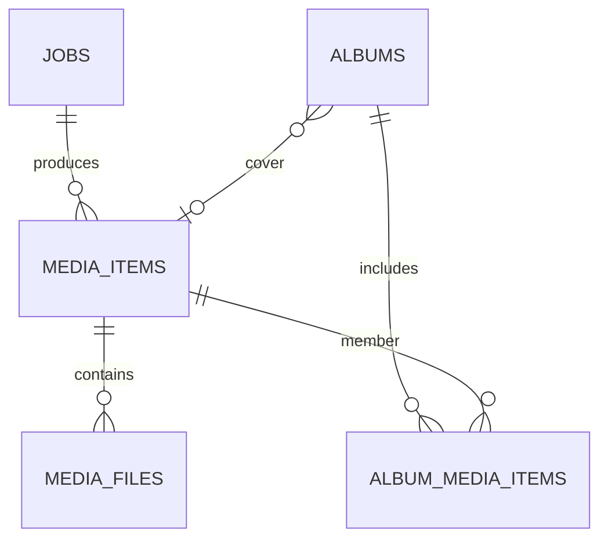

# Entity Relationship Diagram

> Document Type: ERD  
> Status: Draft  
> Owner: [TBD — confirm with team]  
> Last Updated: 2026-09-24  
> Related Documents: [Data Dictionary](data-dictionary.md), [Database Schema](../02-architecture/database-schema.md)

Source: SQLAlchemy models in `backend/app/db.py`. SQLite is default.

Tables: `accounts`, `jobs`, `media_items`, `media_files`, `albums`, `album_media_items`, `platform_adapters`, `app_settings`, `auto_sync_config`, plus `schema_migrations` created by migration setup. Exact columns and constraints: [Database Schema](../02-architecture/database-schema.md).
