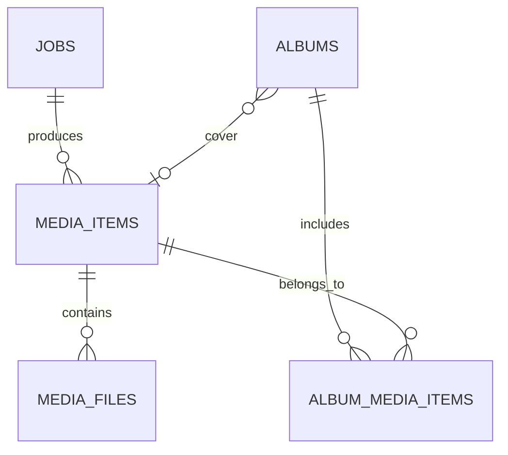

# Entity Relationship Diagram

> Document Type: ERD  
> Status: Draft  
> Owner: [TBD — confirm with team]  
> Last Updated: 2026-08-27  
> Related: [Data Dictionary](data-dictionary.md), [Database Schema](../02-architecture/database-schema.md)

## Overview

The database uses SQLAlchemy models with SQLite as default. `media_items` references `jobs`; `media_files` references media items; album membership uses `album_media_items`; `auto_sync_config` and `platform_adapters` are independent configuration tables.

## Logical model

## Physical model

Tables and columns are defined in `backend/app/db.py`:

- `accounts`: `id`, `platform`, `username`, `encrypted_session`, `created_at`.
- `jobs`: `id`, `platform`, `url`, `status`, `error`, `created_at`, `started_at`, `finished_at`, `lease_until`, `lease_token`, `attempts`.
- `media_items`: `id`, `job_id`, `platform`, `source_url`, `username`, `caption`, `posted_at`, `hashtags`, `sha256`, `is_favorite`, `created_at`.
- `media_files`: `id`, `media_item_id`, `path`, `kind`, `sha256`.
- `albums`: `id`, `name`, `description`, `cover_media_id`, `created_at`, `updated_at`.
- `album_media_items`: `id`, `album_id`, `media_item_id`, `added_at`.
- `platform_adapters`: `id`, `platform`, `adapter_name`, `engine`, `engine_version`, `enabled`, `last_health_at`, `health_ok`.
- `auto_sync_config`: `id`, `platform`, `enabled`, `sync_saved`, `sync_liked`, `interval_minutes`, `last_sync_at`, `last_sync_status`, `last_error`, `items_synced_total`, `last_discovered_count`, `last_enqueued_count`, `last_skipped_count`, `last_failed_count`.

Constraints include unique album membership, unique platform adapter, unique `(source_url, sha256)`, and foreign keys with cascade on album membership.
