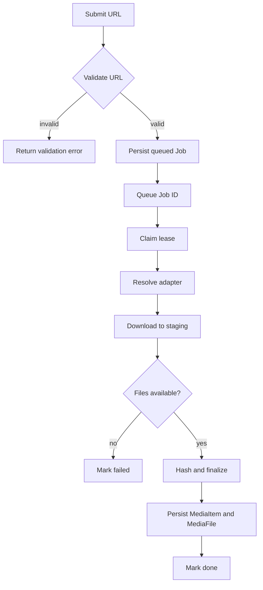
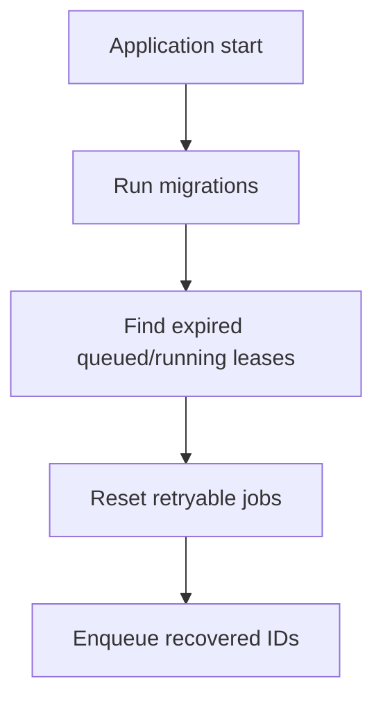

# Flowcharts

> Document Type: Flowcharts  
> Status: Draft  
> Owner: [TBD — confirm with team]  
> Last Updated: 2026-08-27  
> Related: [SRS](SRS.md), [LLD](../02-architecture/LLD.md)

## Download flow

## Recovery flow

