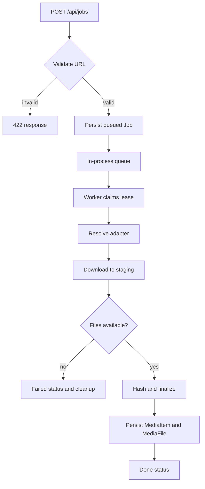
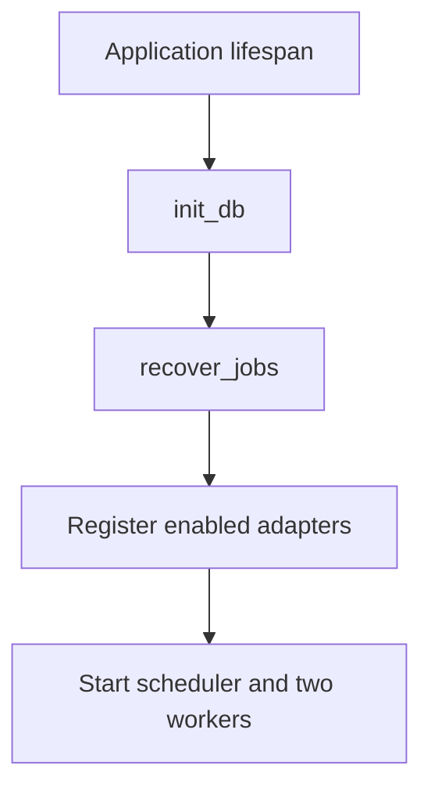

# Flowcharts

> Document Type: Flowcharts  
> Status: Draft  
> Owner: [TBD — confirm with team]  
> Last Updated: 2026-09-24  
> Related Documents: [SRS](SRS.md), [LLD](../02-architecture/LLD.md), [Use Cases](use-cases.md)

