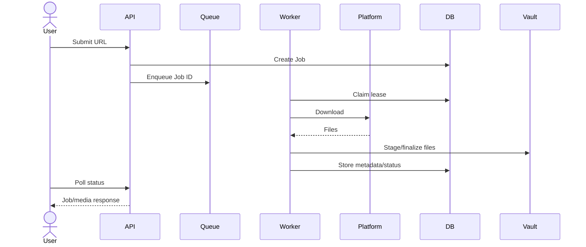

# Use Cases

> Document Type: Use Cases  
> Status: Draft  
> Owner: [TBD — confirm with team]  
> Last Updated: 2026-08-27  
> Related: [SRS](SRS.md), [HLD](../02-architecture/HLD.md), [API](../03-technical/api.md)

## Actors

- **User:** local operator.
- **Scheduler:** periodic autosync trigger.
- **Platform:** external social-media service.

## UC-001 Download URL

**Related:** [FR-001](SRS.md#functional-requirements), [FR-002](SRS.md#functional-requirements)

1. User submits HTTPS URL.
2. API validates host, credentials, port, and DNS.
3. System creates queued job.
4. Worker claims job and selects adapter.
5. Adapter downloads files.
6. System hashes, organizes, and stores metadata.
7. User polls job/vault status.

Failure: invalid URL returns validation error; download failure marks job failed.

## UC-002 Manage vault

**Related:** [FR-003](SRS.md#functional-requirements)

User lists media, filters/paginates, views files, favorites, assigns albums, deletes, or exports.

## UC-003 Import/export

**Related:** [FR-004](SRS.md#functional-requirements)

User uploads supported archive data or requests CSV/JSON/ZIP export. Limits apply.

## UC-004 Autosync

**Related:** [FR-005](SRS.md#functional-requirements)

Scheduler or user trigger reads Instagram saved posts, deduplicates, and enqueues downloads.

## Flow

