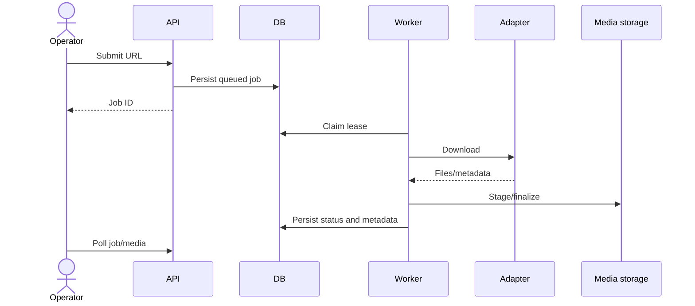

# Use Cases

> Document Type: Use Cases  
> Status: Draft  
> Owner: [TBD — confirm with team]  
> Last Updated: 2026-09-24  
> Related Documents: [SRS](SRS.md), [HLD](../02-architecture/HLD.md), [API](../03-technical/api.md)

## Actors

Local operator, scheduler, external platform, download engine.

## UC-001 Download URL

1. Operator submits URL.
2. API validates and enqueues job.
3. Worker claims lease and selects registered adapter.
4. Adapter/engine downloads to staging.
5. Service hashes, persists metadata/files, and finalizes storage.
6. Operator polls job/media state.

Invalid input returns validation failure; download failure marks job failed.

## UC-002 Manage vault

Operator lists/filter media, retrieves files/thumbnails, toggles favorites, manages albums, deletes items, and exports data.

## UC-003 Import/export

Operator uploads supported archive data and requests supported export formats. Exact formats and limits are route/config facts; business retention is `[TBD — confirm with team]`.

## UC-004 Autosync

Scheduler or operator triggers Instagram saved-post discovery. Items are deduplicated and enqueued.

