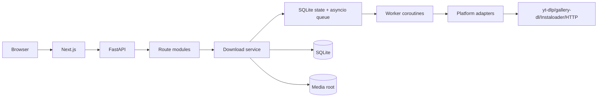

# High-Level Design

> Document Type: HLD  
> Status: Draft  
> Owner: [TBD — confirm with team]  
> Last Updated: 2026-08-27  
> Related: [SRS](../01-requirements/SRS.md), [LLD](LLD.md), [API](../03-technical/api.md)

## System shape

MediaVault is a modular monolith: Next.js frontend proxies `/api/*` to FastAPI. FastAPI routes call services, a SQLite-backed job state coordinates an in-process `asyncio.Queue`, and workers invoke platform adapters. Files live under configured media root.

## Runtime components

- Frontend: `frontend/src/app`, components, shared API helper.
- API: `backend/app/main.py` and `backend/app/routes`.
- Domain services: `service.py`, `autosync.py`, `importer.py`.
- Persistence: `db.py` SQLAlchemy models and migrations.
- Operations: scheduler, worker, launch scripts, GitHub Actions.

## Security boundary

Default bind is loopback. API routes use single-user Bearer token. Health GET is public. URL validation restricts approved HTTPS hosts and public DNS; fallback HTTP redirects are revalidated. Multi-user auth, CSRF/Origin policy, and production TLS are `[TBD — confirm with team]`.
