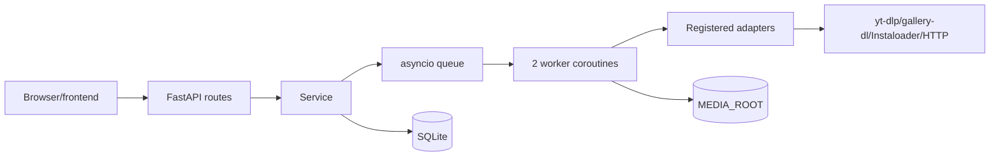

# High-Level Design

> Document Type: HLD  
> Status: Draft  
> Owner: [TBD — confirm with team]  
> Last Updated: 2026-09-24  
> Related Documents: [SRS](../01-requirements/SRS.md), [LLD](LLD.md), [API](../03-technical/api.md), [Deployment](../03-technical/deployment.md)

MediaVault is a modular monolith. FastAPI exposes API routes; a lifespan registers adapters, initializes/recoveries SQLite state, starts scheduler and two workers. Job dispatch uses an in-process queue; job state persists in SQLite; media persists under configured filesystem root.

Registered adapters: Instagram, X, Threads, YouTube, Reddit, Pinterest, TikTok, Vidara. Facebook adapter import exists but registration is disabled in `backend/app/main.py`.

Authentication middleware permits `GET /api/health`, `/api/auth*`, `OPTIONS`, and non-API paths; other API routes accept Bearer token or valid session. CORS allows `http://127.0.0.1:3000`. Production TLS, network topology, and multi-user authorization: `[TBD — confirm with team]`.
