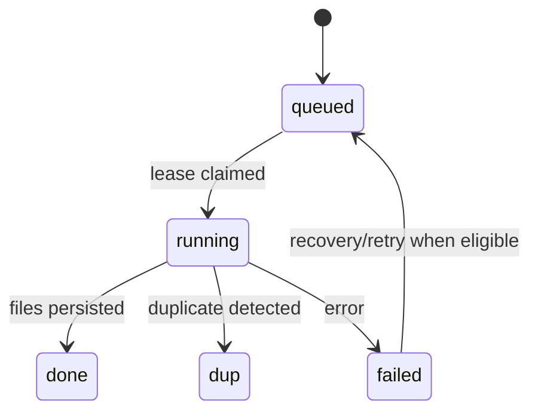

# Low-Level Design

> Document Type: LLD  
> Status: Draft  
> Owner: [TBD — confirm with team]  
> Last Updated: 2026-09-24  
> Related Documents: [HLD](HLD.md), [SRS](../01-requirements/SRS.md), [API](../03-technical/api.md), [Schema](database-schema.md)

## Module map

| Module | Responsibility |
|---|---|
| `main.py` | App creation, middleware, lifespan, adapter registration. |
| `routes/` | HTTP contracts for auth, jobs, media, albums, imports, autosync, settings, health, console. |
| `service.py` | Enqueue, queue, claims, orchestration, deduplication. |
| `worker.py` | Worker loop and job transitions. |
| `db.py` | Models, SQLite engine, migrations. |
| `url_validation.py` | URL and public-DNS validation. |
| `adapters/` | Platform-specific extraction/download behavior. |
| `scheduler.py` | Adapter health and scheduled tasks. |

## Job lifecycle

Database state is authoritative. Staging/filesystem changes cannot share SQLite transaction; cleanup is compensating. Reconciliation policy: `[TBD — confirm with team]`.
